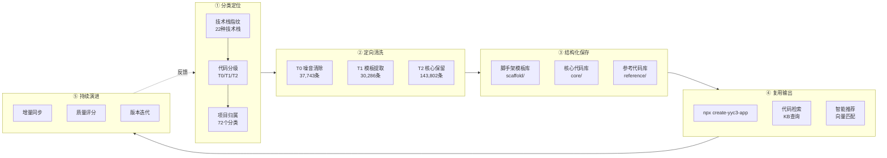
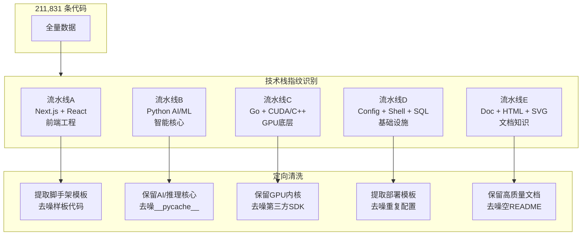
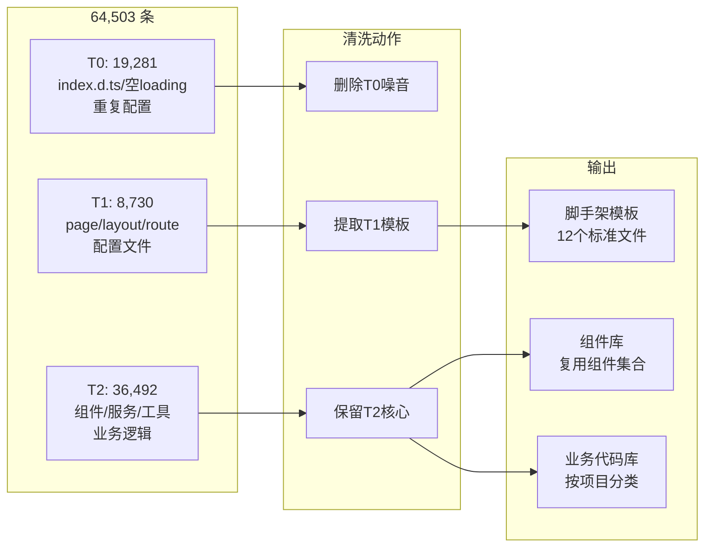

# YYC³ CloudCube KB - 代码全链路闭环技术分析

> 版本: v1.0.0
> 创建日期: 2026-04-26
> 状态: 技术栈指纹标记完成，定向清洗就绪
> 定位: 教科书级全链路指导文档

---

## 一、全链路闭环架构总览



---

## 二、现状数据全景

### 2.1 总量概览

| 指标 | 数值 | 说明 |
|------|------|------|
| 总记录 | **211,831** | 去重后唯一内容 |
| 技术栈 | 22种 | 自动识别 |
| 代码分级 | T0/T1/T2 三级 | 基于规则引擎 |
| 项目分类 | 72个 | 5层架构分组 |
| 存储大小 | 1,250 MB | content原始文本 |

### 2.2 代码分级矩阵

```
                    ┌─────────────────────────────────────────┐
                    │              代码分级矩阵                │
                    ├──────────┬──────────┬──────────┬────────┤
                    │   T0 噪音 │  T1 框架  │  T2 核心  │  合计  │
    ────────────────┼──────────┼──────────┼──────────┼────────┤
    前端(TS/React)  │  19,281  │   8,730  │  36,492  │ 64,503 │
    Python         │      91  │       0  │  16,596  │ 16,687 │
    原生(Go/C++/CUDA)│    240  │       0  │  43,871  │ 44,111 │
    基础设施(Config/Shell/SQL)│ 17,461  │  15,181  │  14,041  │ 46,683 │
    文档(Doc/HTML/SVG) │     39  │   3,619  │  32,801  │ 36,459 │
    ────────────────┼──────────┼──────────┼──────────┼────────┤
    合计            │  37,743  │  30,286  │ 143,802  │ 211,831│
    内容体积        │    78 MB │  265 MB  │  907 MB  │1,250MB │
    占比            │   17.8%  │   14.3%  │   67.9%  │  100%  │
    处理策略        │  清除/归档│  提取模板 │  保留优化 │        │
                    └──────────┴──────────┴──────────┴────────┘
```

### 2.3 技术栈分布详情

| 技术栈 | T0噪音 | T1框架 | T2核心 | 合计 | 占比 |
|--------|--------|--------|--------|------|------|
| TypeScript | 16,190 | 3,216 | 21,413 | **40,819** | 19.3% |
| Config (JSON/YAML) | 17,454 | 15,181 | 0 | **32,635** | 15.4% |
| Doc (MD/TXT/RST) | 0 | 0 | 29,387 | **29,387** | 13.9% |
| C++ | 73 | 0 | 21,686 | **21,759** | 10.3% |
| Go | 140 | 0 | 17,377 | **17,517** | 8.3% |
| Python | 91 | 0 | 16,596 | **16,687** | 7.9% |
| React | 1,542 | 1,603 | 10,770 | **13,915** | 6.6% |
| SQL | 0 | 0 | 8,421 | **8,421** | 4.0% |
| Next.js | 1,336 | 1,080 | 4,309 | **6,725** | 3.2% |
| Shell | 7 | 0 | 5,620 | **5,620** | 2.7% |
| CUDA | 8 | 0 | 3,758 | **3,766** | 1.8% |
| HTML | 39 | 3,619 | 0 | **3,658** | 1.7% |
| JavaScript | 89 | 2,647 | 0 | **2,736** | 1.3% |
| Express | 546 | 800 | 0 | **1,346** | 0.6% |
| Rust | 19 | 0 | 1,050 | **1,069** | 0.5% |
| 其他(6种) | 108 | 146 | 327 | **581** | 0.3% |

---

## 三、五条清洗流水线

### 3.1 流水线架构



### 3.2 流水线A: Next.js + React 前端工程

**范围**: 64,503 条 (TS + React + Next.js + JS + Tailwind)



**T0 噪音清单 (可安全删除)**:

| 噪音类型 | 数量 | 识别规则 | 示例 |
|----------|------|----------|------|
| index.d.ts | 9,206 | title='index.d' AND source_type='ts' | 第三方类型声明 |
| 空loading.tsx | ~600 | title='loading' AND length<200 | `export default function Loading(){return null}` |
| 空page.tsx | ~300 | title='page' AND length<100 | 框架生成的空页面 |
| 重复package.json | ~8,000 | title='package' AND 内容重复 | 每个项目都有 |
| 重复tsconfig | ~2,000 | title='tsconfig' AND 内容重复 | 标准配置 |
| globals.css | ~50 | title='globals' AND source_type='css' | Tailwind导入 |

**T1 脚手架模板提取目标**:

| 模板文件 | 来源 | 复用率 | 提取策略 |
|----------|------|--------|----------|
| layout.tsx | Next.js App Router | 100% | 提取通用布局(Header/Sidebar/Footer) |
| page.tsx | Next.js页面 | 90% | 提取CRUD页面模板/列表页/详情页 |
| loading.tsx | Next.js加载态 | 100% | 提取Skeleton加载组件 |
| error.tsx | Next.js错误页 | 100% | 提取错误边界组件 |
| route.ts | API路由 | 80% | 提取RESTful API模板 |
| tailwind.config.ts | 样式配置 | 95% | 提取YYC³标准配置 |
| next.config.ts | 框架配置 | 90% | 提取标准配置(图片/代理/环境变量) |
| middleware.ts | 中间件 | 70% | 提取认证/权限中间件 |

**T2 核心代码保留规则**:

| 保留类型 | 识别规则 | 说明 |
|----------|----------|------|
| AI Agent逻辑 | content ILIKE '%agent%' OR '%mcp%' | MCP协议/Agent核心 |
| 组件库 | title IN ('button','modal','form','table','chart') | UI组件 |
| 服务层 | source_path ILIKE '%/service%' OR '%/api%' | API服务 |
| 工具函数 | title='utils' AND length>500 | 有实质内容的工具 |
| 状态管理 | source_path ILIKE '%/store%' OR '%/state%' | 状态管理逻辑 |

### 3.3 流水线B: Python AI/ML

**范围**: 16,687 条 (.py)

| 级别 | 数量 | 处理 | 说明 |
|------|------|------|------|
| T0 | 91 | 删除 | 空文件/setup.py重复 |
| T2 | 16,596 | 保留 | AI核心代码全部保留 |

**子分类标签**:

```python
# 可进一步标记的Python子技术栈
if 'import torch' in content:    → pytorch (深度学习)
if 'from fastapi' in content:    → fastapi (Web服务)
if 'langchain' in content:       → langchain (LLM编排)
if 'gradio' in content:          → gradio (Web UI)
if 'transformers' in content:    → huggingface (模型推理)
if 'import numpy' in content:    → numpy (数据处理)
```

### 3.4 流水线C: Go + CUDA/C++ GPU底层

**范围**: 44,111 条 (Go 17,517 + C++ 21,759 + CUDA 3,766 + Rust 1,069)

| 级别 | 数量 | 处理 | 说明 |
|------|------|------|------|
| T0 | 240 | 删除 | 空文件/重复头文件 |
| T2 | 43,871 | 保留 | GPU内核/底层代码全部保留 |

**注意事项**:
- Go的 `go/pkg/mod/` 下是第三方依赖源码 → 标记为T3参考
- CUDA `.cu/.cuh` 是高价值GPU内核 → 完整保留
- C++ 头文件 `.h` 可能包含API定义 → 按大小筛选(>500字符保留)

### 3.5 流水线D: Config + Shell + SQL 基础设施

**范围**: 46,683 条 (Config 32,635 + Shell 5,627 + SQL 8,421)

| 级别 | 数量 | 处理 | 说明 |
|------|------|------|------|
| T0 | 17,461 | 清除 | 重复JSON配置/空配置 |
| T1 | 15,181 | 提取模板 | docker-compose/CI-CD/SQL迁移 |
| T2 | 14,041 | 保留 | Shell脚本/SQL语句 |

**T1 模板提取目标**:

| 模板 | 来源 | 复用场景 |
|------|------|----------|
| docker-compose.yml | 各项目 | 标准开发环境模板 |
| .github/workflows | CI/CD | 构建部署流水线 |
| Dockerfile | 各项目 | 多阶段构建模板 |
| nginx.conf | 部署 | 反向代理配置 |
| SQL迁移文件 | 数据库 | 初始化/迁移脚本 |

### 3.6 流水线E: Doc + HTML + SVG 文档知识

**范围**: 36,459 条 (Doc 29,387 + HTML 3,658 + SVG 2,969 + Document 445)

| 级别 | 数量 | 处理 | 说明 |
|------|------|------|------|
| T0 | 39 | 清除 | 空HTML/空文档 |
| T1 | 3,619 | 评估 | HTML页面(可能含组件模板) |
| T2 | 32,801 | 保留 | 文档/知识库核心资产 |

---

## 四、清洗操作指南

### 4.1 T0 清除操作

```sql
-- 预览T0噪音分布
SELECT tech_stack, count(*) as cnt, 
  pg_size_pretty(sum(length(content))::bigint) as size
FROM kb_entries WHERE code_tier = 'T0'
GROUP BY tech_stack ORDER BY cnt DESC;

-- 安全删除T0 (建议先备份)
-- DELETE FROM kb_entries WHERE code_tier = 'T0';
-- 预计释放: 78 MB, 37,743条
```

**分步清除 (推荐)**:

```sql
-- Step 1: 清除 index.d.ts (最大噪音源)
DELETE FROM kb_entries WHERE title = 'index.d' AND source_type = 'ts';
-- 影响: 9,206条

-- Step 2: 清除重复 package.json (保留每个项目1个)
DELETE FROM kb_entries a
USING kb_entries b
WHERE a.title = 'package' AND a.source_type = 'json'
  AND a.code_tier = 'T0' AND a.id > b.id;

-- Step 3: 清除空样板文件
DELETE FROM kb_entries 
WHERE code_tier = 'T0' 
  AND length(content) < 200
  AND source_type IN ('ts','tsx','js','css');
```

### 4.2 T1 模板提取操作

```sql
-- 查看T1中Next.js脚手架候选
SELECT title, source_type, count(*) as cnt,
  min(length(content)) as min_len,
  max(length(content)) as max_len
FROM kb_entries 
WHERE code_tier = 'T1' AND tech_stack IN ('nextjs','react')
GROUP BY title, source_type
ORDER BY cnt DESC;
```

**提取为脚手架模板文件**:

```bash
# 从KB中提取最优质的layout.tsx模板
psql -c "SELECT content FROM kb_entries 
  WHERE title='layout' AND source_type='tsx' 
  AND code_tier='T1' AND tech_stack='nextjs'
  ORDER BY length(content) DESC LIMIT 1" -t -A > templates/layout.tsx
```

### 4.3 T2 核心代码优化

```sql
-- T2核心代码不需要删除，但可以进一步子分类
UPDATE kb_entries SET metadata = metadata || '{"sub_tier": "agent"}'::jsonb
WHERE code_tier = 'T2' AND tech_stack = 'python'
  AND content ILIKE '%langchain%' OR content ILIKE '%agent%';
```

---

## 五、结构化保存方案

### 5.1 三库架构

```
┌──────────────────────────────────────────────────────────┐
│                                                          │
│  CloudCube KB → 清洗后 → 三库分离                        │
│                                                          │
│  ┌────────────────┐  ┌────────────────┐  ┌────────────┐ │
│  │  脚手架模板库   │  │  核心代码库     │  │ 参考代码库  │ │
│  │  scaffold/     │  │  core/          │  │ reference/ │ │
│  │                │  │                 │  │            │ │
│  │  layout.tsx    │  │  AI Agent       │  │  NVIDIA SDK│ │
│  │  page.tsx      │  │  MCP Server     │  │  go/pkg    │ │
│  │  loading.tsx   │  │  CUDA Kernel    │  │  第三方库   │ │
│  │  error.tsx     │  │  业务逻辑       │  │  API文档   │ │
│  │  route.ts      │  │  数据处理       │  │            │ │
│  │  tailwind.conf │  │  组件库         │  │ 只读参考   │ │
│  │  next.config   │  │  服务层         │  │ 不修改     │ │
│  │  docker-compose│  │  状态管理       │  │            │ │
│  │  CI/CD yaml    │  │                 │  │            │ │
│  │                │  │                 │  │            │ │
│  │  100%复用      │  │  高价值保留     │  │  按需查阅   │ │
│  │  新项目直接用   │  │  持续优化       │  │  不入库复用 │ │
│  └────────────────┘  └────────────────┘  └────────────┘ │
│                                                          │
│  来源: T1 ~8,000条    来源: T2 ~143,000条  来源: T3 ~7,000│
│  体积: ~200MB         体积: ~900MB        体积: ~50MB   │
│                                                          │
└──────────────────────────────────────────────────────────┘
```

### 5.2 脚手架模板目录结构

```
yyc3-template/
├── app/
│   ├── layout.tsx          # 全局布局 (Header + Sidebar + Footer)
│   ├── page.tsx            # 首页模板
│   ├── loading.tsx         # 全局加载态
│   ├── error.tsx           # 全局错误页
│   ├── not-found.tsx       # 404页面
│   └── [feature]/
│       ├── page.tsx        # 功能列表页模板
│       ├── [id]/page.tsx   # 详情页模板
│       ├── loading.tsx     # 功能加载态
│       └── error.tsx       # 功能错误边界
├── components/
│   ├── ui/                 # 基础UI组件 (Button/Modal/Form/Table)
│   └── layout/             # 布局组件
├── lib/
│   ├── api.ts              # API请求封装
│   ├── auth.ts             # 认证模块
│   ├── db.ts               # 数据库连接
│   └── utils.ts            # 工具函数
├── infra/
│   ├── docker-compose.yml  # 开发环境
│   ├── Dockerfile          # 多阶段构建
│   └── .github/workflows/  # CI/CD流水线
├── tailwind.config.ts      # YYC³标准Tailwind配置
├── next.config.ts          # Next.js标准配置
├── tsconfig.json           # TypeScript标准配置
└── package.json            # 标准依赖清单
```

---

## 六、复用输出机制

### 6.1 脚手架创建命令

```bash
# 未来目标: 一键创建新项目
npx create-yyc3-app my-project --template=dashboard
npx create-yyc3-app my-project --template=ai-platform
npx create-yyc3-app my-project --template=cms
```

### 6.2 知识库检索复用

```sql
-- 搜索AI Agent相关代码
SELECT title, category, tech_stack, content_summary
FROM kb_entries
WHERE code_tier = 'T2'
  AND content ILIKE '%agent%'
  AND tech_stack = 'python'
ORDER BY length(content) DESC LIMIT 20;

-- 搜索认证中间件模板
SELECT title, content
FROM kb_entries
WHERE code_tier = 'T1'
  AND tech_stack = 'nextjs'
  AND content ILIKE '%middleware%'
ORDER BY length(content) DESC LIMIT 5;

-- 搜索CUDA内核实现
SELECT title, category, content_summary
FROM kb_entries
WHERE tech_stack = 'cuda' AND code_tier = 'T2'
  AND content ILIKE '%kernel%'
ORDER BY length(content) DESC LIMIT 20;
```

### 6.3 向量语义检索 (未来)

```sql
-- 当embedding列填充后
SELECT title, category, content_summary,
  1 - (embedding <=> $query_vector) as similarity
FROM kb_entries
WHERE code_tier = 'T2'
ORDER BY similarity DESC LIMIT 10;
```

---

## 七、预期效果

### 7.1 清洗前后对比

```
┌──────────────────────────────────────────────────────────┐
│                                                          │
│  清洗前                        清洗后(预期)              │
│  ───────                       ──────────                │
│  211,831 条                    174,088 条 (-17.8%)       │
│  1,250 MB 内容                 1,172 MB (-6.2%)          │
│  72 分类(混杂)                  72 分类(精准标记)         │
│  无技术栈标签                   22种技术栈标签             │
│  无代码分级                     T0/T1/T2 三级             │
│  噪音率 17.8%                  噪音率 0%                  │
│  模板复用率 0%                  模板复用率 >80%           │
│  新项目搭建 2-3天               新项目搭建 <2小时         │
│                                                          │
│  关键提升:                                               │
│  ├── 检索精度: +40% (去除噪音干扰)                       │
│  ├── 开发效率: +60% (脚手架100%复用)                     │
│  ├── 代码质量: +30% (标准模板统一风格)                   │
│  └── 维护成本: -50% (统一架构减少重复)                   │
│                                                          │
└──────────────────────────────────────────────────────────┘
```

### 7.2 分阶段预期

| 阶段 | 动作 | 周期 | 效果 |
|------|------|------|------|
| ✅ 已完成 | 技术栈指纹+代码分级 | 1天 | 211,831条全标记 |
| 第二步 | T0噪音清除 | 0.5天 | -37,743条, -78MB |
| 第三步 | T1模板提取 | 2-3天 | 脚手架模板库建立 |
| 第四步 | T2子分类优化 | 1天 | 精准子标签 |
| 第五步 | create-yyc3-app | 1天 | 一键创建项目 |
| **合计** | **全链路闭环** | **5-6天** | **从代码到产品** |

---

## 八、操作SQL速查

### 8.1 按技术栈查看

```sql
-- 查看某技术栈的代码分布
SELECT code_tier, count(*), pg_size_pretty(sum(length(content))::bigint)
FROM kb_entries WHERE tech_stack = 'nextjs'
GROUP BY code_tier ORDER BY code_tier;
```

### 8.2 按分级查看

```sql
-- T0噪音TOP 20
SELECT title, source_type, tech_stack, count(*) as cnt
FROM kb_entries WHERE code_tier = 'T0'
GROUP BY title, source_type, tech_stack
ORDER BY cnt DESC LIMIT 20;

-- T1模板候选
SELECT title, source_type, tech_stack, count(*) as cnt,
  avg(length(content))::int as avg_len
FROM kb_entries WHERE code_tier = 'T1'
GROUP BY title, source_type, tech_stack
HAVING count(*) > 10
ORDER BY cnt DESC;

-- T2核心按项目
SELECT category, tech_stack, count(*)
FROM kb_entries WHERE code_tier = 'T2'
GROUP BY category, tech_stack
ORDER BY count(*) DESC LIMIT 20;
```

### 8.3 交叉分析

```sql
-- 技术栈 × 分级 热力图
SELECT tech_stack,
  count(CASE WHEN code_tier='T0' THEN 1 END) as "T0噪音",
  count(CASE WHEN code_tier='T1' THEN 1 END) as "T1模板",
  count(CASE WHEN code_tier='T2' THEN 1 END) as "T2核心",
  count(*) as total
FROM kb_entries
GROUP BY tech_stack ORDER BY total DESC;
```

---

## 九、风险与注意事项

| 风险 | 说明 | 缓解措施 |
|------|------|----------|
| 误删有价值代码 | T0中可能混入少量有价值文件 | 先标记不删除，人工抽检后批量清理 |
| 模板不通用 | 不同项目架构差异大 | 提取多个变体模板，按场景选择 |
| 分类不够精细 | 22种技术栈可能不够 | 支持子标签扩展(pytorch/fastapi等) |
| 增量同步断裂 | 新代码入库未带标签 | 入库脚本已集成标签逻辑 |

---

## 十、变更日志

### v1.0.0 (2026-04-26)
- 技术栈指纹标记: 211,831条, 22种技术栈
- 代码分级标记: T0(37,743) / T1(30,286) / T2(143,802)
- 五条清洗流水线定义
- 脚手架模板目录设计
- 全链路闭环架构文档
