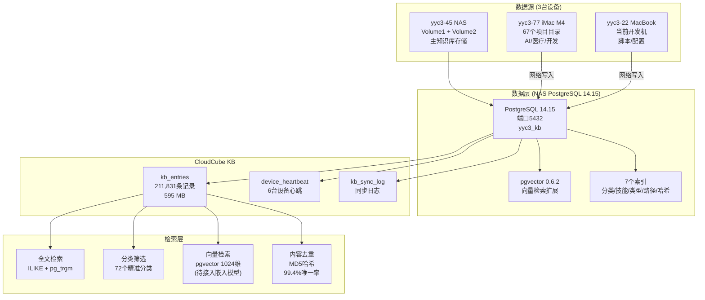
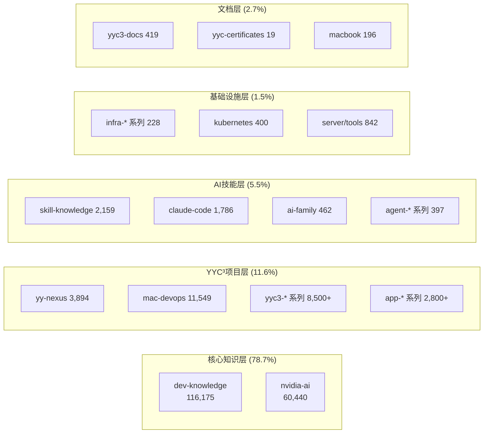

# YYC³ CloudCube KB - 知识库架构与操作指南

> 创建日期: 2026-04-25
> 版本: v3.0.0
> 状态: 全域入库完成
> 最后更新: 2026-04-26 (NAS双卷+iMac全域入库，分类清洗完成)

---

## 一、总体架构



---

## 二、知识库核心数据

### 2.1 总览

| 指标           | 数值            |
| -------------- | --------------- |
| 总记录数       | **211,831**     |
| 唯一内容       | 210,553 (99.4%) |
| 分类数         | **72**          |
| 文件类型       | 47种            |
| 表大小         | 595 MB          |
| 总大小(含索引) | 1,394 MB        |
| 入库批次       | 6批次           |
| 总入库耗时     | ~390秒          |
| 入库脚本       | 6个             |

### 2.2 入库批次记录

| 批次 | 来源                             | 原始数        | 去重后      | 耗时      | 脚本                  |
| ---- | -------------------------------- | ------------- | ----------- | --------- | --------------------- |
| ①    | AI Skill知识库 (yyc3-22)         | 14,915→11,493 | 11,493      | 14.2s     | kb-ingest.py          |
| ②    | NVIDIA AI (/Volume2/yyc3_sd)     | 53,569        | 53,569      | 39.3s     | kb-ingest-nvidia.py   |
| ③    | 腾讯文档 (/Volume1/www/腾讯文档) | 412           | 412         | 70.5s     | kb-ingest-docs.py     |
| ④    | www/全目录 (/Volume1/www)        | 136,209       | 84,226      | 105.2s    | kb-ingest-www.py      |
| ⑤    | NAS双卷全扫描 (Volume1+Volume2)  | 33,613        | 33,613      | 41.2s     | kb-ingest-nas-full.py |
| ⑥    | iMac M4 (yyc3-77)                | 69,544        | 28,518      | 53.0s     | kb-ingest-imac77.py   |
|      | **合计**                         | **308,262**   | **211,831** | **~390s** |                       |

> 去重: 总入库308,262条，经content_hash去重后保留211,831条，去重率31.2%

---

## 三、分类体系 (72个精准分类)

### 3.1 分类架构总览



### 3.2 完整分类表

#### 核心知识层

| 分类          | 数量        | 说明                          | 来源设备 |
| ------------- | ----------- | ----------------------------- | -------- |
| dev-knowledge | 116,175     | 开发智库(AI/API/Agent/LLM)    | NAS      |
| nvidia-ai     | 60,440      | NVIDIA CUDA/TensorRT/深度学习 | NAS+iMac |
| **小计**      | **176,615** | **83.4%**                     |          |

#### YYC³ 项目层

| 分类                 | 数量       | 说明             | 来源设备 |
| -------------------- | ---------- | ---------------- | -------- |
| mac-devops           | 11,549     | Mac DevOps项目集 | NAS      |
| yy-nexus             | 3,894      | YY-Nexus多项目   | NAS      |
| yyc3-ai-studio       | 1,482      | AI Studio        | iMac     |
| yyc3-table-converter | 1,210      | 表格转换器       | iMac     |
| yyc3-code-ai         | 656        | Code AI          | iMac     |
| openharmony          | 604        | 鸿蒙开发         | iMac     |
| yyc3-project         | 582        | 综合项目         | NAS+iMac |
| app-yyc-m            | 525        | YYC-M            | iMac     |
| yyc3-pi              | 514        | π系列            | iMac     |
| yyc3-portable        | 482        | 便携智能系统     | iMac     |
| yyc3-ai-platform     | 306        | AI PAI平台       | iMac     |
| yyc3-mcp             | 345        | MCP协议          | iMac     |
| yyc3-ai-call         | 289        | AI呼叫           | iMac     |
| app-dashboard        | 283        | 仪表盘           | NAS+iMac |
| yyc3-learning        | 201        | 学习资源         | NAS      |
| yyc3-ai-medical      | 190        | AI医疗           | iMac     |
| yyc3-cube            | 188        | 智慧平台         | NAS      |
| yyc3-ide             | 182        | IDE技能          | NAS      |
| app-yyc-zuoyou       | 158        | 左右CRM          | iMac     |
| yyc3-mobile          | 131        | 移动端           | iMac     |
| yyc3-ai-family       | 30         | AI Family        | iMac     |
| yyc3-i18n            | 27         | 国际化           | iMac     |
| yyc3-github          | 95         | GitHub镜像       | NAS      |
| app-yyc-mech         | 51         | 机械风           | iMac     |
| app-search           | 35         | 搜索应用         | iMac     |
| app-yyc-model        | 27         | 模型工具         | iMac     |
| app-yyc-ai-lan       | 23         | AI蓝             | iMac     |
| app-music            | 20         | 音乐             | iMac     |
| app-yyc-ollama       | 17         | Ollama平台       | iMac     |
| app-forum            | 14         | 论坛             | iMac     |
| app-nas-ddns         | 11         | NAS DDNS         | iMac     |
| app-digital-human    | 11         | 数字人           | iMac     |
| app-spline           | 8          | Spline 3D        | iMac     |
| app-business         | 6          | 商务管理         | iMac     |
| app-yyc-club         | 4          | Club管理         | iMac     |
| app-globe            | 3          | 地球组件         | iMac     |
| app-yyc-smart-office | 2          | 智慧办公         | iMac     |
| app-saas             | 90         | SaaS平台         | iMac     |
| app-task             | 79         | 任务管理         | iMac     |
| app-yyc-npm          | 41         | NPM包            | iMac     |
| app-misc             | 97         | 杂项应用         | iMac     |
| yyc3-zhishu          | 485        | 智枢平台         | iMac     |
| **小计**             | **24,544** | **11.6%**        |          |

#### AI 技能层

| 分类               | 数量      | 说明            |
| ------------------ | --------- | --------------- |
| skill-knowledge    | 2,159     | AI技能知识      |
| claude-code        | 1,786     | Claude Code技能 |
| max-code           | 853       | Max代码         |
| plugin             | 478       | 插件系统        |
| ai-family          | 462       | AI Family       |
| server             | 420       | 服务端          |
| kubernetes         | 400       | K8s             |
| agent-skill        | 280       | Agent技能       |
| code-skill         | 265       | 代码技能        |
| dev-wiki           | 264       | 开发Wiki        |
| ai-devops          | 234       | AI DevOps       |
| prompt-engineering | 183       | 提示工程        |
| mui                | 178       | MUI组件         |
| figma              | 173       | Figma设计       |
| claude-prompts     | 157       | Claude提示词    |
| code-ai            | 143       | Code AI         |
| agent              | 117       | Agent           |
| glm-skill          | 112       | GLM技能         |
| mcp-integration    | 105       | MCP集成         |
| packages           | 41        | NPM包           |
| **小计**           | **8,955** | **4.2%**        |  |

#### 基础设施层

| 分类         | 数量    | 说明       |
| ------------ | ------- | ---------- |
| infra-docker | 195     | Docker配置 |
| infra-env    | 13      | 环境配置   |
| infra-frpc   | 12      | 内网穿透   |
| infra-backup | 8       | 系统备份   |
| tools        | 422     | 工具集     |
| **小计**     | **650** | **0.3%**   |  |

#### 文档层

| 分类             | 数量    | 说明              |
| ---------------- | ------- | ----------------- |
| yyc3-docs        | 419     | 腾讯文档/个人文档 |
| macbook          | 196     | MacBook代码       |
| macbook-code     | 113     | MacBook项目       |
| yyc-certificates | 19      | YYC商标/证书      |
| **小计**         | **747** | **0.4%**          |  |

---

## 四、文件类型分布 (TOP 20)

| 类型             | 数量   | 占比  | 说明         |
| ---------------- | ------ | ----- | ------------ |
| TypeScript (.ts) | 46,159 | 21.8% | 主力开发语言 |
| JSON (.json)     | 28,788 | 13.6% | 配置/数据    |
| Markdown (.md)   | 22,779 | 10.7% | 文档         |
| Go (.go)         | 17,517 | 8.3%  | 后端/NVIDIA  |
| Python (.py)     | 16,687 | 7.9%  | AI/脚本      |
| TSX (.tsx)       | 14,881 | 7.0%  | React组件    |
| C++ (.cpp)       | 12,133 | 5.7%  | CUDA/底层    |
| SQL (.sql)       | 8,421  | 4.0%  | 数据库       |
| C Header (.h)    | 6,368  | 3.0%  | 头文件       |
| Shell (.sh)      | 5,627  | 2.7%  | 运维脚本     |
| Text (.txt)      | 4,708  | 2.2%  | 文本         |
| HTML (.html)     | 3,658  | 1.7%  | 页面         |
| JavaScript (.js) | 3,230  | 1.5%  | 脚本         |
| SVG (.svg)       | 2,969  | 1.4%  | 图标/图形    |
| YAML (.yaml)     | 2,850  | 1.3%  | 配置         |
| CUDA (.cu)       | 2,678  | 1.3%  | GPU内核      |
| RST (.rst)       | 1,900  | 0.9%  | Python文档   |
| XML (.xml)       | 1,870  | 0.9%  | 配置         |
| C (.c)           | 1,625  | 0.8%  | 底层代码     |
| 其他 (27种)      | 7,083  | 3.3%  | 混合         |

---

## 五、三层防重体系


| 层级     | 机制                 | 效果             |
| -------- | -------------------- | ---------------- |
| 路径级   | source_path唯一索引  | 同一文件绝不重复 |
| 内容级   | content_hash MD5     | 已清93,109条重复 |
| 入库预检 | 所有脚本自动计算hash | 新入库自动带哈希 |

---

## 六、检索使用指南

### 6.1 按分类检索

```sql
SELECT title, source_path, source_type FROM kb_entries
WHERE category = 'nvidia-ai' LIMIT 20;
```

### 6.2 全文关键词检索

```sql
SELECT title, category, content_summary FROM kb_entries
WHERE content ILIKE '%pgvector%'
ORDER BY length(content) DESC LIMIT 20;
```

### 6.3 按设备来源检索

```sql
SELECT category, count(*) FROM kb_entries
WHERE source_path LIKE 'imac77%' GROUP BY category ORDER BY count(*) DESC;
```

### 6.4 去重查询

```sql
SELECT content_hash, count(*) FROM kb_entries
GROUP BY content_hash HAVING count(*) > 1
ORDER BY count(*) DESC LIMIT 10;
```

---

## 七、入库脚本清单

| 脚本                  | 用途                    | 执行位置        |
| --------------------- | ----------------------- | --------------- |
| kb-ingest.py          | AI Skill知识入库        | yyc3-22/NAS     |
| kb-ingest-nvidia.py   | NVIDIA知识入库          | NAS本地         |
| kb-ingest-docs.py     | 文档(PDF/DOCX/XLSX)入库 | NAS本地         |
| kb-ingest-www.py      | www/全目录入库          | NAS本地         |
| kb-ingest-nas-full.py | NAS双卷全扫描入库       | NAS本地         |
| kb-ingest-imac77.py   | iMac M4项目入库         | iMac本地→NAS DB |

---

## 八、NAS环境信息

| 项目       | 值                             |
| ---------- | ------------------------------ |
| 设备       | TNAS F4-423                    |
| 系统       | Ubuntu 22.04 (TNAS)            |
| PostgreSQL | 14.15 (原生安装)               |
| pgvector   | 0.6.2                          |
| 端口       | 5432                           |
| 数据库     | yyc3_kb                        |
| SSH        | port 9557, user YYC/root       |
| 存储路径   | /Volume1/www, /Volume2/yyc3_sd |

---

## 九、待办事项

| 优先级 | 事项                       | 状态       |
| ------ | -------------------------- | ---------- |
| 高     | 向量嵌入 (embedding列填充) | 待部署     |
| 高     | MCP-postgres对接           | 待配置     |
| 高     | 增量同步机制               | 待开发     |
| 中     | 腾讯文档云端1600+导出      | 待用户操作 |
| 中     | DGX Spark嵌入模型部署      | 待硬件就绪 |
| 低     | 全文搜索优化(zhparser)     | 待评估     |

---

## 十、变更日志

### v3.0.0 (2026-04-26)
- NAS双卷全扫描入库 (Volume1 + Volume2)
- iMac M4 (yyc3-77) 67个项目入库
- 分类体系清洗: 103→72个精准分类
- 三层防重体系建立: content_hash MD5
- 总去重93,109条 (入库308,262→保留211,831)
- 修复PG中文搜索配置错误
- 6个入库脚本统一加入content_hash

### v2.0.0 (2026-04-25)
- NVIDIA AI知识域53,569条入库
- www/全目录136,209条入库
- 文档更新至266MB

### v1.0.0 (2026-04-25)
- 初始版本
- AI Skill知识库11,493条入库
- pgvector 0.6.2安装
- kb_entries表创建
