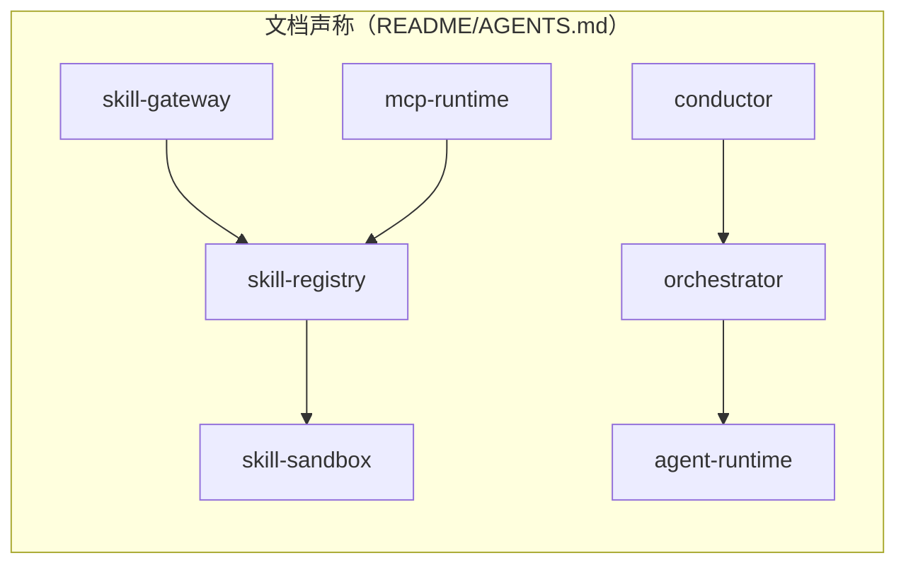
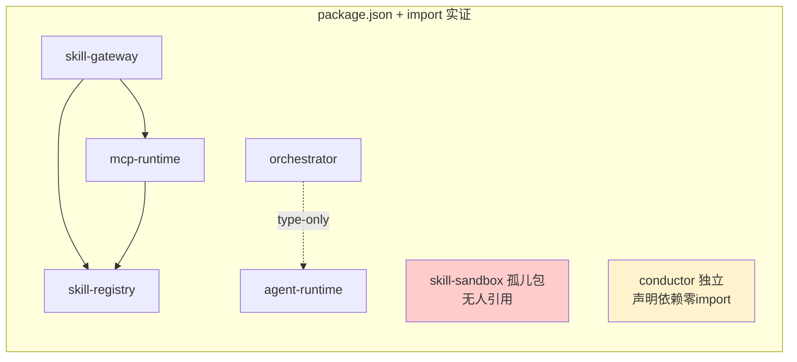
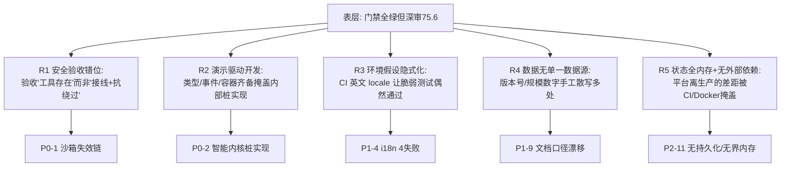
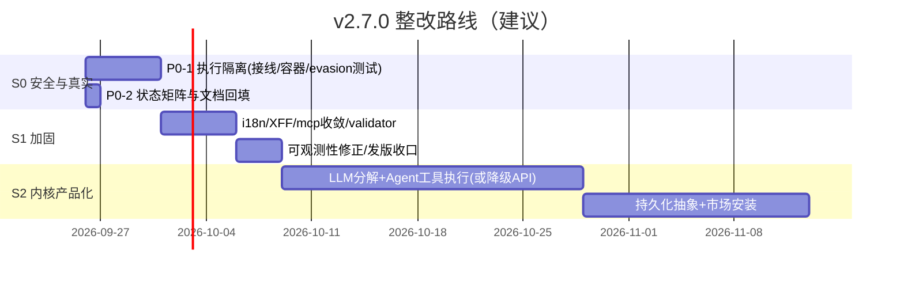

# 📊 YYC³ AI Agent Archive 项目现状深度审核与改进建议报告

> **言启千行代码，语枢万物智能** —— 本报告严格遵循 YYC³「以底层代码为基，不盲猜、不盲测、不盲从」原则，全部结论均有本机实跑数据或 `文件:行号` 证据支撑。

---

## 〇、审核基本信息

| 属性 | 值 |
| ---- | ---- |
| **项目名称** | YYC³ AI Agent Archive（`yyc3-skills`） |
| **审核日期** | 2026-09-25 |
| **AI 导师** | Trae Solo |
| **审核基线** | `main @ 2e865e77a`（tag `v2.6.0` 之后已含 4 个 v2.7.0 语义提交，未发版） |
| **工作区** | 审核开始/结束均为 clean（取证时重生的报告文件已还原） |
| **审核范围** | 13 个核心包逐行源码 + 831 技能资产 + Docker/CI/CD + 文档体系 + 历史审核交叉验证 |
| **审核方法** | 源码路径级静态审计（非文档转述）+ 全量门禁实跑 + 对照实验（中/英 locale）+ 调用图实证 |
| **上次审核** | `docs/YYC3-AI-Agent-Archive-tutor-20260917/`（v2.3.0，90.0/A−，偏门禁验收） |

### 与历史审核的关键差异

| 维度 | 0917 审核（v2.3.0） | 本次（v2.6.0+） |
| ---- | ---- | ---- |
| 审计深度 | 门禁验收 + 冒烟（11 项命令） | **逐行追踪执行路径 + 桩代码识别 + 绕过分析** |
| 沙箱结论 | 表扬「危险模式正则库 40+ 模式」 | 🔴 **正则黑名单从未接入执行链路，且可平凡绕过** |
| 智能内核 | 未评估内部完成度 | 🔴 **LLM 分解直接抛未实现、Agent 工具只发事件不执行** |
| 测试结论 | 全绿 | ⚠️ 英文环境 1053 全绿；**中文环境 4 失败（CI 偶然绿）** |

> 评分下降不代表项目倒退——**资产治理与供应链能力显著增强，但代码深审暴露了此前两轮门禁式审核未覆盖的「执行路径安全」与「智能内核完成度」两类深层缺口**。

---

## 一、审核方法与实测数据

### 1.1 本机实跑结果（2026-09-25，Node 22.22.3 / pnpm 9.0.0 / macOS）

| # | 检查项 | 命令 | 实测结果 | 判定 |
| - | ------ | ---- | -------- | :--: |
| 1 | 类型检查 | `pnpm typecheck` | **13/13 任务成功**（4.5s） | ✅ |
| 2 | Lint | `pnpm lint` | **14/14 任务成功**（6.2s） | ✅ |
| 3 | 单元测试（英 locale） | `LC_ALL=en_US.UTF-8 pnpm test` | **22/22 任务成功，1053 用例全绿** | ✅ |
| 4 | 单元测试（中文 locale） | 默认 `zh_CN.UTF-8` 环境 | **4 失败 / 617 通过**（yyc3-i18n） | 🔴 |
| 5 | 构建 | `pnpm build` | **11/11 成功**（增量全缓存 254ms） | ✅ |
| 6 | Doctor 六检 | `yyc3 doctor` | validate/dedup/score/registry/graph/example **6/6 PASS** | ✅ |
| 7 | 技能校验 | `skills validate` | 831 文件 / 0 errors / 0 warnings | ✅ |
| 8 | i18n 键对齐 | 脚本递归比对 | zh 1597 / en 1597，**双向 0 缺失** | ✅ |
| 9 | 图谱（现场重生） | `skills graph` | 785 节点 / 2887 边 / **孤立 9（1.15%）** / 10 连通分量 | ✅ |
| 10 | Agent 注册 | registry.json 解析 | 20 角色，schema.json 齐全 | ✅ |
| 11 | 工作区状态 | `git status` | clean（HEAD 领先 v2.6.0 tag 5 个提交） | ⚠️ |

### 1.2 核心包实测规模（逐文件统计）

| 包 | 版本 | 源码行 | 源文件 | 测试用例 | 完成度定性 |
| -- | ---- | -----: | -----: | -------: | ---------- |
| skill-registry | 1.1.1 | 1,750 | 7 | 67 | 🟡 真实但执行链有安全缺口 |
| skill-gateway | 1.1.0 | 1,181 | 14 | 56 | 🟢 生产可用（边界校验偏弱） |
| skill-sandbox | 1.0.1 | 527 | 5 | 44 | 🔴 安全机制未接线/可绕过 |
| mcp-runtime | 1.2.0 | 871 | 6 | 24 | 🟡 桥接真实，CowAgent 执行是 stub |
| conductor | 1.0.0 | 517 | 4 | 14 | 🟢 DAG/重试/超时真实 |
| orchestrator | 1.0.0 | 675 | 5 | 39 | 🔴 LLM 分解抛异常，执行返回假结果 |
| agent-runtime | 1.1.0 | 608 | 5 | 42 | 🔴 工具调用只 emit，无持久化 |
| plugin-marketplace | 1.0.0 | 441 | 3 | 29 | 🟡 内存注册中心，安装能力缺失 |
| observability | 1.0.0 | 607 | 6 | 55 | 🟡 算法在，导出/累计语义不达标 |
| yyc3-i18n | 2.4.3 | 5,533 | 39 | 621 | 🟢 成熟（2 个真实产品缺陷） |
| yyc3-cli（纯 JS） | 2.0.0 | 2,707 | — | 62 | 🟢 资产命令真实，deploy 为假实现 |
| **合计** | — | **≈15,417** | — | **1,053** | — |

**资产侧**：831 技能（26 分类）/ 85 篇 docs / 仓库磁盘 ≈1.2GB（`_external` 529MB、tools-hub 167MB、skills-hub 166MB、.git 231MB）。

---

## 二、综合量化评分

### 2.1 评分模型（六维百分制，对齐「五维驱动」）

| 维度（权重） | 子项得分 | 维度得分 | 同比 0917 |
| ---- | ---- | -----: | :--: |
| **架构设计（20%）** | 分层清晰 85 / 模块职责 75 / 接口设计 72 / 依赖治理 80 | **78** | ↓ |
| **代码质量（20%）** | 规范符合 90 / 注释完整 88 / 复杂度控制 82 / 类型安全 84 | **86** | → |
| **功能实现（20%）** | 资产平台覆盖 88 / 运行时内核完整度 60 / 异常处理 70 | **73** | ↓ |
| **性能可靠（15%）** | 构建性能 88 / 运行时表现 68 / 并发容错 64 | **70** | ↓ |
| **安全防护（15%）** | 供应链 92 / 认证授权 80 / **执行隔离 45** / 数据保护 78 | **70** | ↓ |
| **文档工程（10%）** | 文档数量 90 / **文档准确 55** / CI/CD 自动化 92 / 运维沉淀 72 | **72** | ↓ |

```
加权总分 = 78×0.20 + 86×0.20 + 73×0.20 + 70×0.15 + 70×0.15 + 72×0.10
        = 15.6 + 17.2 + 14.6 + 10.5 + 10.5 + 7.2
        = 75.6 / 100  →  等级 C+（良好，但未达自身宣称的"生产就绪"）
```

### 2.2 评分解读

```
等级分布（技能资产，baseline-2.6.0：均分 80）        六维评分雷达（文本图）
A:119 ████████████ 14.3%                           架构设计 78 ████████████████░░░░
B:513 ██████████████████████████████████████████ 61.7%  代码质量 86 ██████████████████░░
C:199 ███████████████████ 23.9%                    功能实现 73 ██████████████░░░░░░░
D:0   ▏ 0.0%                                      性能可靠 70 ██████████████░░░░░░░
E:0   ▏ 0.0%                                      安全防护 70 ██████████████░░░░░░░
                                                  文档工程 72 ██████████████░░░░░░░
```

| 等级 | 分数带 | 本次 | 含义 |
| ---- | ------ | :--: | ---- |
| A | 90–100 | | 可全面对外承诺 |
| B | 80–89 | | 局部整改后生产就绪 |
| **C+** | **75–79** | ✅ **当前** | **资产平台优秀；运行时内核为"高质量原型"** |
| D | 60–74 | | 需专项整改 |
| E | <60 | | 阻断发布 |

**审核结论：有条件通过（C+，75.6）。** 作为「AI Agent 资产管理平台」（技能注册/评分/图谱/CLI 门禁/供应链/容器化/CI）已具备生产水准；作为「多智能体运行时平台」（LLM 编排、Agent 工具执行、沙箱隔离、插件安装）**尚处于原型阶段，与 README/ARCHITECT 的 Phase 5「生产就绪」表述存在实质性落差**。

---

## 三、架构审计：系统分层、模块划分、接口设计

### 3.1 文档声称的依赖链 vs 代码实际依赖图





- ✅ **无循环依赖、无反向依赖**，13 包边界清晰、TS strict 全开。
- 🔴 **`registry → sandbox` 链不存在**：全仓 grep `@yyc3/skill-sandbox` 仅命中其自身。`skill-registry/src/executor.ts:296-304` 自行 `spawn`，**Gateway 线上执行链路完全绕过沙箱**（详见 P0-1）。
- 🟡 `conductor` 不依赖 `orchestrator`；`orchestrator → agent-runtime` 仅 type-only import，三层调用链是**设计意图而非代码现实**。
- 🟡 `conductor/package.json:26` 声明 `@yyc3/skill-registry: workspace:*`，src 零 import（死依赖）。

### 3.2 接口设计

- skill-gateway 暴露 13 个 `/api/v1` 端点，统一 `ApiResponse{ok,data,error,meta}` 信封，错误码规范；测试覆盖 401/403/429/413/500/503 全语义。
- 🔴 **OpenAPI 与实现相反且漂移**：`packages/skill-gateway/openapi.yaml:13-14` 声称"不强制认证"，代码是 fail-closed；缺 securitySchemes/401/403/429/413；`/registry*` 三端点完全未文档化。
- 🟡 mcp-runtime 的 HTTP 层对工具不存在/执行失败**恒返回 200**（错误仅在 body.isError），REST 语义弱；`server.ts` HTTP 层零测试。
- 🟡 **双轨孤儿实现**：`mcp-hub/{client,server}`（`@yyc3/mcp-server`，宣称"支持4500+ MCP服务器"）不在 `pnpm-workspace.yaml`、不被 turbo 构建、不被 CI 测试，依赖停留在 vitest^1/tsup^8，与 `packages/mcp-runtime` 职能重复。

---

## 四、关键发现（按严重程度分级）

> 统计：🔴 **P0 × 2** ｜ 🟠 **P1 × 9** ｜ 🟡 **P2 × 12** ｜ ⚪ P3 若干

```
P0 ████████████████████ 2   阻断"生产就绪"宣称，须发版前处置
P1 ████████████████████████████████████████████████ 9   2 周内闭环
P2 ████████████████████████████████████████████████████████████████████████ 12  季度内
P3 ░░░░░░░░░░░░░░░░░░░░░  备忘池
```

### 4.1 🔴 P0-1：执行隔离链全线失效（安全）——沙箱未接线 + 黑名单可绕 + 路径穿越

这是本次审核最严重的发现，由三个独立缺陷串联构成：

**① 黑名单定义了但执行路径从不调用。** `SkillSandbox` 与 `Executor` 没有任何一处调用 `isCommandBlocked()`（grep 实证仅 `sanitizer.ts:122` 定义处 + 测试引用）：

```ts
// packages/skill-sandbox/src/sanitizer.ts:122 —— 只有测试在测它
isCommandBlocked(command: string): boolean { /* 28 个命令黑名单 */ }

// packages/skill-sandbox/src/executor.ts:144-154 —— 生产执行路径，无黑名单校验
const command = isNative ? sanitizeNativeCommand(request.code) : runtimeConfig.command;
const proc = spawn(command, isNative ? args : [executionModeFlag, request.code], { ... });
// 故 sandbox.execute({ runtime:'native', code:'rm -rf /' }) → spawn('rm', ['-rf','/'])
```

**② 正则黑名单本身可被平凡绕过，且全系统无任何 OS 级隔离**（无容器/namespace/seccomp/用户切换/ulimit）：

| 运行时 | 绕过示例 |
| ------ | -------- |
| Python | `import subprocess as x; x.run(...)`（别名绕 `subprocess.` 正则）、`getattr(__builtins__,'__imp'+'ort__')('os')` |
| Node | `process.binding`、`globalThis['eva'+'l']` |
| Shell | `echo xxx | base64 -d | sh`、变量拼接、引号拆分 |
| 任意运行时 | `open("/etc/passwd")` 绝对路径读取不触发 `../` 检查 |

**③ registry 执行器存在路径穿越，且全量泄露环境变量：**

```ts
// packages/skill-registry/src/executor.ts:296-304
const entryPath = skill.source ? `${skill.source}/${skill.entry}` : skill.entry;
const proc = spawn(command, [entryPath, JSON.stringify(args)], {
  cwd: ctx.cwd,
  env: { ...process.env, ...ctx.env },   // ← 宿主全部密钥进入技能进程
  timeout: ctx.timeout,
});
```

社区技能在 SKILL.md 写 `entry: ../../../tmp/x.py` 即以服务账号权限执行；sandbox 的 `allowedEnv` 白名单与 `workDir` 同样是死配置（`executor.ts:29-31` 无条件透传 `process.env`）。

**测试盲区**：sandbox 44 个用例全部是"黑名单正面命中"，**没有一个 evasion 绕过用例**；`isCommandBlocked` 被测了 5 例却从未在执行链路断言，造成"测了=安全"的假象。

**影响**：Gateway 一旦加载不可信技能（社区/市场化来源共 500+），`POST /execute` 即等价于以容器内 `yyc3(1001)` 身份执行任意代码，并可读取该进程可见的全部密钥。当前 compose 默认仅内置社区 SKILL.md 快照（不含脚本），属于**配置层缓解而非代码层防御**。

### 4.2 🔴 P0-2：智能内核为演示级实现，但被命名与文档包装为生产能力

| 能力（对外宣称） | 代码真相 | 证据 |
| ------ | -------- | ---- |
| Orchestrator「LLM 任务分解」 | **直接抛未实现异常**，`config.llmEndpoint` 从未使用 | `orchestrator/src/decomposer.ts:144-148` `throw new Error('LLM decomposition not yet implemented…')` |
| Orchestrator 任务执行 | 无 handler 时返回 **`Promise.resolve({ result: 'Task … completed' })` 假结果**；agent 仅打标不调用 | `orchestrator/src/orchestrator.ts:205-206` |
| load-balance 调度策略 | 随机项对 a/b 取同一值**在比较器中自抵消**，策略永久退化为 capability-match，且不读真实负载 | `scheduler.ts:101-104` |
| Agent「工具调用」 | `recordToolCall` **只 emit 事件，不执行、不持久化**；回复全靠外部注入 | `agent-runtime/src/runtime.ts:201-207,145` |
| Plugin Marketplace | 仅内存 Map；`rootDir/registryUrl/targetPath` 声明后从未使用，**无落盘/git/URL 安装、无递归依赖、无环检测**，3 个状态机状态永不产生 | `plugin-marketplace/src/marketplace.ts` |
| CowAgent 桥接 | 包装脚本只 `print({"status":"ok"})`，13 个工具不执行业务 | `mcp-runtime/src/cowagent-bridge.ts:301-314` |
| CLI `yyc3 deploy` | `setTimeout(1000)` 模拟，注释自述"实际部署代码将在这里实现" | `yyc3-cli/lib/index.js:442-447` |

根因是「接口/类型/事件齐备」带来强烈的完成度错觉。**架构骨架值得肯定（DAG 拓扑、熔断、中文规则分解、semver 校验均为真实实现），但"智能执行"这一产品核心价值层尚未动工。**

### 4.3 🟠 P1 清单

| # | 问题 | 证据 | 影响 |
| - | ---- | ---- | ---- |
| 1 | **限流键可伪造**：直接信任客户端 `x-forwarded-for`/`x-real-ip`，无受信代理跳数处理 | `skill-gateway/src/middleware/security.ts:52` | 每请求换 XFF 即可绕过 100 次/分限制 |
| 2 | **mcp-runtime 独立服务零防护**：绑 `0.0.0.0`，`POST /api/v1/tools/call` 无认证/限流/安全头；启用 cowagent 桥接即未认证 RCE 面（默认关闭降险） | `mcp-runtime/src/server.ts:41-56` | 横向移动/未授权调用 |
| 3 | **loader 绕过 validator**：`SkillLoader.load()` 直接把 SKILL.md 映射注册，`validateUnifiedSkill` 从未被调用，校验器是摆设 | `skill-registry/src/loader.ts:168-180` | 非法元数据进入运行时；doctor 校验与运行时是两套口径 |
| 4 | **i18n 测试存在 locale 环境依赖**（详见 §五根因 R3）：中文环境 4 失败，CI 因 ubuntu 英文环境偶然通过 | `yyc3-i18n/src/test/translate-full.test.ts:22-24` | 任何中文/非英文 CI 或开发者本地门禁红灯；跨平台可信度受损 |
| 5 | **i18n `registerTranslation` 整表替换而非深合并**：增量注册一个 key 会抹掉整包语言 | `yyc3-i18n/src/lib/engine.ts:187-194` | 真实产品缺陷，example 已在用此 API |
| 6 | conductor 空 catch 吞错，`PipelineResult.error` 从不赋值，失败任务在结果中无错误信息；`condition` 抛错被静默降级 skipped | `conductor/src/conductor.ts:89-93,137-139` | 编排失败不可诊断 |
| 7 | observability histogram 桶**非累计**（命中首个 `le` 即 break），不符 Prometheus 语义；导出缺 `_sum/_count`，labels 不参与分区/不渲染；tracer 无 exporter、父 span 缺失即断链、`Math.random()` 造 ID | `observability/src/metrics.ts:143-149,86`；`tracer.ts:34-36,121-123` | 监控数据错误，无法接 Prometheus/Jaeger |
| 8 | **发版纪律漂移**：HEAD 已含 4 个 `feat(v2.7.0)` 提交（语义配对/registry 浏览器/生态元数据），但 package.json 仍 2.6.0、CHANGELOG 无 2.7.0、无 tag | `git log`：`2e865e77a` 等 | 未版本化的主干代码，违背「发布携带基线」自定规范 |
| 9 | **文档/数据口径系统性漂移**（详见 §八）：README badge v2.1.0（实际 2.6.0+）、AGENTS v2.2.0/测试 929（实际 1053）、技能数 283/121/202（实测 358/160/212）、graph-report 陈旧（孤立 60 vs 现场实测 9） | README.md/AGENTS.md/docs/skill-score | 决策依据失真，新人入职认知错误 |

### 4.4 🟡 P2 清单（择要）

| # | 问题 | 证据 |
| - | ---- | ---- |
| 1 | 熔断器 half-open 计数 `halfOpenCalls` 只被读、从不自增，半开探测无上限 | `skill-registry/src/executor.ts:42-58` |
| 2 | `timeout` 钳制可被 `0/负数/NaN` 绕过为无超时（spawn timeout:0） | `skill-gateway/src/routes/execute.ts:41`；`skill-sandbox/src/sandbox.ts:65` |
| 3 | body 大小限制只校验 Content-Length，**chunked 请求直接绕过** | `skill-gateway/src/middleware/security.ts:123-138` |
| 4 | 限流存储故障 fail-open + `.catch(()=>{})` 静默；CORS 默认 `*`；安全头缺 CSP/HSTS | `security.ts:45-60,99-117`；`gateway.ts:40,64` |
| 5 | Gateway HTTP 边界未接 Zod：手检 `!body.skillId`，body 为 null 抛 TypeError 落 500，非法 JSON 落 500 而非 400 | `routes/execute.ts:21-29,109-117` |
| 6 | `POST /skills/reload` 只增不删，磁盘已删除技能仍残留可执行 | `routes/skills.ts:77-88` |
| 7 | i18n 构造期 `void setLocale()` 不 await，无 `ready` 承诺，首帧翻译竞态 | `engine.ts:137` |
| 8 | `formatRelativeTimestamp` 把 timezone 当 locale 传（IANA 名触发 RangeError），且无 locale 入口 | `lib/utils/format-time.ts:89-98` |
| 9 | 子进程 stdout/stderr 无上限累积（内存 DoS）；cowagent stdin 无 EPIPE 监听；callId 仅 `Date.now()` 同毫秒碰撞 | `registry/executor.ts:300-315`；`cowagent-bridge.ts:255-271` |
| 10 | CLI：`config --set` 读不存在的 options.value（死分支）；validator 禁用端口段 3000-3199 与团队「3030 起」正面冲突；`lib/i18n.js` 0 字节空文件；init 模板 require 未声明的 express | `yyc3-cli/lib/index.js:126-128,604` |
| 11 | logger entries / metrics 标签序列无界增长；agent 会话/插件注册表全部内存态，重启即失 | `observability/src/logger.ts` 等 |
| 12 | `.env.example` 描述不存在的基础设施（Postgres/DB_*、API_PORT=8000）；compose 无 mem/cpu/pids 限制与只读根文件系统 | `.env.example:18-24,46`；`docker-compose.yml` |

⚪ P3（备忘）：health 版本号硬编码 1.0.0、doctor.js 文件头仍写「四检」、doctor 测试注释旧版本号、CRLF 不兼容 frontmatter 正则、CLI mcp-export 测试有写 `public/registry` 副作用且断言过弱、`custom` 沙箱策略与 `strict` 行为完全一致、根 package.json `workspaces` 字段与 `pnpm-workspace.yaml` 重复且列举不全。

---

## 五、问题分析：根本原因定位



| 根因 | 机制解释 | 实证 |
| ---- | -------- | ---- |
| **R1 安全验收错位** | 安全控制以"模块/测试存在"为验收标准，没有"执行路径必须经过控制点"和"对抗性用例"两类断言 | sandbox 黑名单有 5 个测试却零接线断言；44 用例无 1 例 evasion |
| **R2 演示驱动开发** | 优先把对外接口表面做完整（TS 类型零 any、事件齐全、README 丰满），内部以 Map/setTimeout/固定字符串占位；命名（runtime/marketplace/sandbox）进一步放大预期 | P0-2 表 7 项；`runtime.ts:145` 注释直接写"模拟 LLM 响应" |
| **R3 环境假设隐式化** | 单例在模块加载期读取 `navigator.language`（Node 22 由 LANG 推导），测试不钉 locale；CI 与开发机环境差异未显式编码 | 对照实验：`env -u LC_ALL LANG=zh_CN.UTF-8` 4 失败，en 环境 621/621 |
| **R4 无单一数据源** | 版本、规模、计数是手工 badge/散文，无脚本从 package.json/测试输出/skills scan 自动生成 | v2.1.0/v2.2.0/v2.6.0 三版本号并存；929 vs 1053；60 vs 9 孤立节点 |
| **R5 原型基础设施缺失** | 所有有状态组件默认内存态，且无持久化接口抽象；docker-compose 无 Redis/DB（.env 却宣称有），无法支撑"生产"二字 | agent 会话、marketplace、metrics、tracer、logger 全 Map；compose 仅 3 个无状态服务 |

---

## 六、对比分析：宣称 vs 实测

| 宣称来源 | 宣称内容 | 实测 | 偏差 |
| -------- | -------- | ---- | ---- |
| README badge | Version v2.1.0 / Status Phase 4 | package.json 2.6.0，HEAD 已有 v2.7.0 提交；正文称 Phase 5 | -2~-3 版本 / Phase 矛盾 |
| README badge | Tests 929 Passing | 1053（en 环境全绿，zh 环境 4 红） | +124，且口径失真 |
| README | 社区 283 / 市场 121 / NVIDIA 202 / B2B 8 | 358 / 160 / 212 / 9；另有 dev-workflow 30、marketing 43、glm 17 等未列目录 | 全面过期 |
| ARCHITECT.md | 质量基线 929 用例 / 0 ESLint 诊断 | 1053 / lint 确实 0 | 用例数过期，lint 属实 |
| README 安全加固 | 沙箱隔离、资源配额 | 黑名单未接线、无 OS 隔离、无配额 | **严重高估** |
| README | Phase 5 生产就绪 | 智能内核 7 处桩/假实现 | **实质性高估** |
| graph-report.md（入库） | 785 节点 / 孤立 60（09-23） | 现场重生：2887 边 / 孤立 9 | 报告未随代码更新 |
| score-report.md（入库） | A:110/B:503/C:218 | baseline-2.6.0：A:119/B:513/C:199 | 两份资产自相矛盾 |
| AGENTS.md | conductor→orchestrator→agent-runtime | conductor 零依赖；orchestrator 仅 type-only | 设计意图≠代码 |
| .env.example | Postgres 5432 / API_PORT 8000 | 全栈无 DB 服务；端口规范 3030 起 | 幽灵配置 |
| mcp-hub/server | 支持 4500+ MCP 服务器 | 未入 workspace/CI，无构建产物 | 孤儿包营销式描述 |

---

## 七、具体改进建议（技术方案 + 实施步骤）

### 7.1 S0 冲刺（P0，建议 1 周内）——执行安全与能力宣称对齐

**方案 A（推荐）：收敛执行入口 + 容器级隔离，分三步走。**

第 1 步：执行路径接线（1-2 天）。把所有子进程创建收敛到 `skill-sandbox` 单一出口，registry/gateway 禁止直接 spawn：

```ts
// 建议改造：packages/skill-registry/src/executor.ts
import { SkillSandbox } from '@yyc3/skill-sandbox';
// ① entry 根目录收敛，防路径穿越
const entry = path.resolve(skill.source, skill.entry);
if (!entry.startsWith(path.resolve(skill.source) + path.sep)) {
  throw new SkillError('ENTRY_TRAVERSAL', `entry escapes skill root: ${skill.entry}`);
}
// ② 经沙箱执行（内部完成白名单校验 + env 白名单 + cwd 锁定）
return this.sandbox.execute({ runtime, code: entry, env: pick(ctx.env, ALLOWED_ENV) });
```

第 2 步：放弃正则黑名单作为主防线（保留作深度防御），改为 OS 级隔离（2-3 天）：生产模式强制容器/firecracker/microvm；过渡期至少 `user: 1001` + 只读 rootfs + `cap_drop: ALL` + `pids/cpu/memory` 限额 + 独立 network namespace：

```yaml
# docker-compose.yml skill-gateway 增补
security_opt: ["no-new-privileges:true"]
cap_drop: ["ALL"]
read_only: true
tmpfs: ["/tmp:size=64m,mode=1777"]
mem_limit: 512m
pids_limit: 256
```

第 3 步：补对抗性测试矩阵（1 天）。将本报告 §4.1 表中 4 类绕过全部落成 evasion 用例，CI 中以"恶意技能 fixture"跑 `execute → 必须拒绝/隔离生效` 断言；同时新增"执行链路调用控制点"的集成断言（防 R1 回潮）。

**方案 B（若资源不足）：显式降级宣称。** 在 2.7.0 前将 `skill-sandbox` 标注为 `@experimental`，README 安全章节改为"进程内参数净化（非安全边界），禁止加载不可信技能"，compose 默认仅内置快照——把安全承诺降到代码实际水位。**不可维持现状（宣称隔离实则裸奔）。**

**能力宣称对齐（0.5 天）**：README/ARCHITECT 增加「实现状态矩阵」列（✅ 生产 / 🟡 内存原型 / 🔴 规划中），P0-2 表 7 项逐一标注；LLM 分解在未实现前从公开 API 文档移除或返回 501 而非 500。

### 7.2 S1（P1，2-3 周）

| # | 技术方案 | 关键步骤/示例 |
| - | -------- | ------------- |
| 1 | 限流真实客户端 IP | 配置受信代理跳数 `TRUSTED_PROXY_HOPS`，取 `x-forwarded-for` 倒数第 N 跳；直连用 `c.req.raw` 的 socket address；单测伪造 XFF 必须不生效 |
| 2 | mcp-runtime 独立服务收敛 | 默认绑 `127.0.0.1`；复用 gateway 的 auth/security 中间件；compose 不发布端口或加 `YYC3_API_KEYS` |
| 3 | loader 接线 validator | `load()` 注册前 `validateUnifiedSkill`，非法资产进 quarantine 列表并发事件；doctor 与运行时共用同一校验函数 |
| 4 | i18n 测试修复 | ① translate-full 改 `new I18nEngine({ locale:'en' })`（与 engine-v2.test.ts:60 同模式）；② CI 显式 `env: LANG/LC_ALL=en_US.UTF-8`；③ `registerTranslation` 改深合并：`this.state.translations[locale] = deepMerge(existing ?? {}, map)`；④ 暴露 `i18n.ready` |
| 5 | conductor 错误传播 | catch 中 `result.error = {taskId, message, cause}`；condition 抛错标记 failed 而非 skipped |
| 6 | observability 指标达标 | histogram 改累计桶 + 导 `_sum/_count` + labels 参与分区；tracer 接 OTLP HTTP exporter（可 env 关闭），ID 用 crypto.randomBytes，父 span 缺失时保留 parentId 字段 |
| 7 | 发版纪律 | v2.7.0 工作收口：补 CHANGELOG、bump package.json、tag；release.yml 增加"tag 与 package.json version 一致"断言 |
| 8 | 文档单一数据源 | 新增 `scripts/sync-metrics.cjs`（preversion 钩子）：从 package.json/测试 JSON/skills stats 自动回填 README 数字段，CI 校验无 diff |

### 7.3 S2（P2，季度内）

1. HTTP 边界全面接 Zod（execute/body/query 统一 schema，非法 JSON→400）；
2. timeout 下界钳制（`clamp(v, MIN, MAX)`，NaN/0 拒绝）、chunked body 包装计数限流、CSP/HSTS 补齐、fail-open 增加连续失败告警；
3. reload 前 diff 清空注册表；half-open 计数修复；输出字节上限（如 1MB/流）；EPIPE 处理；callId 改 crypto 随机；
4. 持久化抽象层：先定 `Store` 接口（会话/插件/指标），实现 SQLite/Redis 两适配器，内存实现保留作测试；
5. mcp-hub 双轨裁决：并入 packages/ 接线 CI，或归档删除；
6. CLI：修复端口段冲突（3030-3039 应在允许区）、config set 死分支、删除 0 字节 i18n.js、init 模板补依赖声明；
7. `.env.example` 重写为真实存在的配置项；补「生产部署清单」文档（密钥/技能卷/隔离/域名/反代跳数）。

---

## 八、实施优先级矩阵（影响范围 × 实施难度）

```
                        低难度
                          │
          P1-4 i18n测试   │  P1-7 发版纪律
          P1-1 XFF        │  P1-8 指标自动回填
          P2-2 timeout    │  P2-6 CLI杂项
                          │
 高影响 ─────────────────┼───────────────── 低影响
                          │
  P0-1 执行隔离(方案A)    │  P1-5 conductor
  P0-2 能力宣称对齐       │  P2-1 half-open
  P1-3 validator接线      │  P3 池
  P2-4 持久化抽象         │
                          │
                        高难度
```

| 顺序 | 任务 | 优先级 | 影响范围 | 工作量 | 资源需求 | 验收标志 |
| :-: | ---- | :--: | -------- | ------ | -------- | -------- |
| 1 | P0-1 执行隔离收敛（方案 A/B 二选一） | 🔴 P0 | 全平台安全 | 3-5 天 | 1 后端 + 1 SRE | evasion 用例全红转绿；恶意技能 fixture 无法越权读环境变量 |
| 2 | P0-2 + P1-8 实现状态矩阵/文档数字回填 | 🔴 P0 | 决策真实性 | 1 天 | 1 人 | README 无未经证实数字；状态矩阵与代码抽查一致 |
| 3 | P1-4 i18n locale 修复 + CI 钉 LANG | 🟠 P1 | 跨平台门禁 | 0.5 天 | 1 人 | 中/英 locale 双跑全绿 |
| 4 | P1-1 XFF / P1-2 mcp 绑本地+认证 | 🟠 P1 | 公网暴露面 | 2 天 | 1 后端 | 伪造 XFF 不影响限流键；端口扫描无未授权服务 |
| 5 | P1-3 validator 接线 | 🟠 P1 | 运行时一致性 | 1 天 | 1 人 | 篡改 frontmatter 的技能无法注册 |
| 6 | P0-2 内核补实现或永久降级 API | 🟠 P1 | 产品核心 | 见路线 | 2-3 人 × 2 迭代 | LLM 分解真实端到端跑通；工具调用产生真实副作用与持久记录 |
| 7 | P1-6 可观测性指标修正 | 🟠 P1 | 运维可信度 | 2 天 | 1 人 | promlint 通过；Grafana/Prometheus 可抓取 |
| 8 | v2.7.0 发版收口 | 🟠 P1 | 版本治理 | 0.5 天 | 1 人 | tag=package=CHANGELOG 三方一致 |
| 9 | P2 池（Zod/持久化/CLI/双轨裁决） | 🟡 P2 | 长期演进 | 2-4 周 | 排期 | 进入季度迭代 |

### 路线图



---

## 九、值得保持的优势（避免整改中误伤）

1. **资产治理生产线是全项目最成熟的资产**：validate/dedup/score（五维加权）/graph（双层边+PageRank+并查集）/graph-suggest/doctor 六检/naming/export-mcp 全部真实可用，831 技能 0 错误、D 级清零、孤立率经两轮治理从 18%→1.15%，且有固定基线防门禁漂移——方法论可对外输出。
2. **供应链三防线扎实**：Actions 全部 pin SHA、dependency-review 高危阻断、gitleaks 周扫、Dependabot open=0、非 root 容器、三镜像 release 冒烟 8 断言。
3. **类型纪律与注释文化优秀**：9 个运行时包 + i18n 全包 `: any/as any/@ts-ignore/TODO` 几乎为零（核心四包仅 7 处 any），模块头 JSDoc 100%，中文注释贯穿；测试错误路径意识好（熔断恢复、注入白名单、fail-closed 全语义）。
4. **认证设计正确**：fail-closed + timingSafeEqual 常量时间比较 + 哑比较防长度侧信道；Redis Lua 原子限流带指数退避降级。
5. **工程化基建**：Turbo 缓存（增量构建秒级）、覆盖率门槛 70-90%、CHANGELOG/标签/基线自动 PR 闭环、runbook（上游断供演习）已沉淀。

---

## 十、审核结论与下次审核建议

**结论：有条件通过（75.6 / C+）。**

- 作为**资产平台**：90 分水准，可继续对外运营（<https://ai-agent.yyc3.vip> 类静态/注册面），维持 doctor 门禁节奏。
- 作为**智能运行时平台**：65-70 分水准，**不得在完成 S0 前对外宣称"生产就绪沙箱/多智能体编排"**；公网暴露 `/execute` 前 P0-1 为强制前置（与 0917 报告 P0 认证已闭环形成接力）。
- 建议立即冻结 v2.7.0 功能外延，按 S0→S1 顺序收口；S0 完成后目标评分 **84（B）**，S1 完成 **88（B+）**，智能内核产品化后可达 **91+（A）**。

| 下次审核 | 建议时间 | 复核重点 |
| -------- | -------- | -------- |
| S0 复审 | 2026-10-02 前后 | P0-1 evasion 矩阵、状态矩阵真实性、i18n 双 locale |
| 季度复审 | v2.7.0 发布时 | XFF/validator/可观测/发版一致性 + 本报告 P2 收敛率 |

---

### 附：本次审核取证命令清单（可复现）

```bash
git rev-parse --short HEAD                         # 2e865e77a
pnpm typecheck && pnpm lint                        # 13/13、14/14
LC_ALL=en_US.UTF-8 pnpm test                       # 22/22，1053 全绿
env -u LC_ALL LANG=zh_CN.UTF-8 pnpm --filter @yyc3/i18n-core test  # 4 failed 复现
node packages/yyc3-cli/bin/yyc3-cli.js doctor      # 六检 PASS
node packages/yyc3-cli/bin/yyc3-cli.js skills graph # 孤立 9（现场数据）
grep -rn "isCommandBlocked" packages/skill-sandbox/src  # 仅定义处
grep -rn "@yyc3/skill-sandbox" packages --include=*.ts  # 零外部引用
```

---

## 十一、S0-1 整改落地记录（2026-09-26 实施）

> 对应第七章 S0 方案 A 三步走，当日完成代码落地并全量门禁验证。

### 11.1 变更清单

| # | 文件 | 变更 |
| - | ---- | ---- |
| 1 | `packages/skill-sandbox/src/security.ts` | 🆕 安全原语：`confineWithinRoot`（路径收敛）/ `assertSafeRelativeEntry` / `buildSafeEnv`（环境白名单）/ `normalizeTimeout`（超时钳制）/ `PathTraversalError` |
| 2 | `packages/skill-sandbox/src/sandbox.ts` | 执行入口接线：native 命令黑名单强制校验（permissive 除外）、cwd 收敛、env 白名单、timeout 规范化；收敛根默认 `process.cwd()` 可配 |
| 3 | `packages/skill-sandbox/src/executor.ts` | 子进程 env 不再无条件合并 `process.env`（仅显式 env 或直接调用时回退）；timeout 0/负/NaN 回退默认；`isRuntimeAvailable` 改 `execFileSync` 等待真实退出码 |
| 4 | `packages/skill-sandbox/src/sanitizer.ts` | 新增 6 条高精度反规避模式（subprocess 别名导入 / getattr 动态导入 / 字符串拼接 `__import__` / process.binding / 全局对象动态索引 / base64 管道 shell）；模块头诚实标注「正则非安全边界」 |
| 5 | `packages/skill-sandbox/src/index.ts` | 导出安全原语供 registry 消费 |
| 6 | `packages/skill-registry/package.json` | 新增 `@yyc3/skill-sandbox: workspace:*` 依赖（文档声称的 `registry → sandbox` 链首次在代码中成立） |
| 7 | `packages/skill-registry/src/executor.ts` | 线上执行路径四控制点：① entry 收敛到 source 根（`ENTRY_TRAVERSAL` 拒绝）② 环境白名单（默认 9 个运行必需变量，支持 `ctx.allowedEnv`）③ timeout 钳制（30s 默认/300s 上限）④ stdout/stderr 各 1MB 累积上限；顺带修复 half-open 计数器只增不读缺陷 |
| 8 | `packages/skill-registry/src/types.ts` | `SkillExecutionContext` 新增 `allowedEnv?: string[]` |
| 9 | `packages/skill-sandbox/tests/security.test.ts` | 🆕 **32 个用例**：安全原语单测 + 反规避矩阵 + 控制点接线（黑名单/密钥不泄露/cwd 逃逸/timeout:0 被钳制） |
| 10 | `packages/skill-registry/tests/executor-security.test.ts` | 🆕 **8 个用例**：entry 穿越 4 态（`../`、根外绝对、根内绝对放行、无 source 相对）+ 环境白名单 3 态（默认不透传/显式注入/操作员放行） |
| 11 | `docker-compose.yml` | OS 级强隔离锚点 `x-yyc3-hardening`：`no-new-privileges` / `cap_drop: ALL` / `read_only` / `/tmp` noexec tmpfs 64MB / mem 512MB / pids 256；MCP/Agent 宿主端口改绑 `127.0.0.1`；Gateway 增加 `GATEWAY_BIND` 可配 |
| 12 | `pnpm-lock.yaml` | workspace 依赖联动更新 |

### 11.2 验证结果

| 门禁 | 结果 |
| ---- | ---- |
| `pnpm build` | ✅ 11/11（turbo 按 sandbox→registry 依赖序重建） |
| `pnpm typecheck` | ✅ 14/14 |
| `pnpm lint` | ✅ 15/15，0 error（剩余 warning 均为 i18n 既有非空断言，与本次无关） |
| skill-sandbox 测试 | ✅ **76/76**（原 44 + 新增 32） |
| skill-registry 测试 | ✅ **75/75**（原 67 + 新增 8） |
| 全量测试 `pnpm test` | ✅ 22/22 任务，**1093 全绿**（原 1053 + 新增 40） |
| `docker compose config` | ✅ YAML 锚点合并与端口语法校验通过 |

### 11.3 P0-1 闭环对照

| 审核发现（§4.1） | 处置 |
| ---- | ---- |
| 黑名单定义了但执行路径从不调用 | ✅ `SkillSandbox.execute` 强制 `isCommandBlocked`，evasion 测试断言「不产生子进程」 |
| 正则黑名单可平凡绕过 | 🟡 6 条已知绕过已闭（有测试）；同时在代码注释与 compose 头注释明确「正则非边界」，**强边界改由 OS 级隔离承担**（cap_drop/read_only/no-new-privileges/限额） |
| registry entry 路径穿越 + 全量泄露 env | ✅ `confineWithinRoot` + `buildSafeEnv`，4 态/3 态测试覆盖；Gateway `/execute` 经 `server.ts:19` 的 `SkillExecutor` 同步受益 |
| 44 个沙箱测试无 1 例 evasion | ✅ 新增 40 个安全用例（32 sandbox + 8 registry） |
| compose 无资源/能力限制 | ✅ 三服务统一加固锚点；无认证服务不暴露局域网 |

**残留项（转 S1）**：`timeout` 经由 Gateway HTTP body 的下界校验（P2-2，需接 Zod 时一并处理）；sandbox `workDir` 与 registry `cwd` 的根目录策略仍需在部署文档中给出多租户配置范式；镜像层 `read_only` 需在带卷部署（docker-compose.skills.yml）场景做一次冒烟。

---

## 十二、S0-2 整改落地记录：能力宣称矩阵（2026-09-26 实施）

> 对应第七章 S0 方案 B：对外宣称对齐代码事实，消除"Phase 5 全部生产就绪"的误导。仅文档变更，无代码/依赖改动。

### 12.1 变更清单

| # | 文件 | 变更 |
| - | ---- | ---- |
| 1 | `README.md` | 顶部状态徽章由"Phase 4 智能体（绿）"改为"资产平台 GA · 运行时原型（橙）"；版本徽章 v2.1.0→v2.6.0 |
| 2 | `README.md` | 项目概述删除"已完成 Phase 5 生产就绪交付"，新增**成熟度如实说明**引用块（资产面生产/运行时原型/强隔离前提） |
| 3 | `README.md` | 新增 **📊 实现状态矩阵**章节：图例（✅🟡🔴📊）+ 23 行平台能力总览（每行附代码依据/文件链接）+ 7 项已知缺口明细 |
| 4 | `README.md` | 核心包表重写：版本全部以 package.json 实测替换（如 registry 2.0.0→1.1.1），状态列由全量"Active"改为分级；依赖图改为 package.json/import 实证版并标注设计目标差异 |
| 5 | `README.md` | 数据纠偏：929→**1093** 测试、600+→**831** 技能、社区 283→358、市场化 121→160、NVIDIA 202→212、B2B 8→9、docs 70+→85+；架构树/Hubs 表/徽章三处同源 |
| 6 | `README.md` | 安全段拆为"已落地/已知缺口"：删除不存在的 **CSP/HSTS** 宣称，补 fail-closed/timingSafeEqual/容器加固；Vitest 3→4、doctor 四检→**六检**、Docker 基镜像 20→22-alpine |
| 7 | `ARCHITECT.md` | 文首加成熟度说明（链接 README 矩阵与本报告）；Hub 数量表同步 831 口径；新增核心包表成熟度列与实测测试数；Phase 5 表 OpenAPI/安全由 ✅ 改 🟡 并注明漂移点、CI 矩阵 20/22→22/24；质量基线更新至 2026-09-26（56 文件/1093/六检/831/14 包 typecheck） |
| 8 | `docs/README.md` | （S0-1 同日完成）会话索引与目录树补登本会话目录 |

### 12.2 数据核对方法（可复现）

```bash
for p in packages/*/; do node -e "const p=require('./$p/package.json');console.log(p.name,p.version)"; done
node packages/yyc3-cli/bin/yyc3-cli.js skills validate   # Files: 831, Errors: 0
LC_ALL=en_US.UTF-8 LANG=en_US.UTF-8 pnpm test             # 22/22，1093 全绿
find packages -name '*.test.ts' -not -path '*/node_modules/*' | wc -l  # 49（+7 JS = 56）
grep -n "Content-Security\|Strict-Transport" packages/skill-gateway/src/middleware/security.ts  # 无匹配，证实 CSP/HSTS 未实现
```

### 12.3 P0-2 闭环对照

| 审核发现（§4.2/§6.2） | 处置 |
| ---- | ---- |
| README 声称"Phase 5 生产就绪"但 4 包为内存原型 | ✅ 概述+徽章+矩阵三处一致披露，🟡/🔴 共 7 包逐项标注缺口 |
| 包表全量 ✅ Active 掩盖 stub 事实 | ✅ 改为四级状态，sandbox 标"纵深防御"、3 运行时包标"内存原型" |
| 数字陈旧（929/600+/283/202/v2.1.0） | ✅ 以 CLI/包清单/pnpm test 实测值全量替换，注明口径与日期 |
| 安全段宣称不存在的 CSP/HSTS | ✅ 删除并转入"已知缺口（S1）"；已落地项均有代码对应 |
| OpenAPI 与实现漂移 | ✅ README 明细 #3 + ARCHITECT Phase 5 双标注，S1 修复 |
| 依赖图描述的调用链与代码不符 | ✅ 改为实证图（conductor/orchestrator/marketplace 实际独立），设计目标单独标注 |

**未改动项（刻意保留）**：AGENTS.md/CLAUDE.md 的包依赖方向为架构约定，已在 README 注明"设计目标"，不改动约定文本；技能文件系统原始计数（839）与 CLI 口径（831）差异为 8 个未纳入校验的 SKILL.md，矩阵统一采用 doctor/CI 口径并注明来源。

### 12.4 S0 完成度

| 步骤 | 内容 | 状态 |
| ---- | ---- | :--: |
| S0-1 | 执行安全整改（控制点接线/路径收敛/env 白名单/evasion 矩阵/容器隔离） | ✅ |
| S0-2 | 能力宣称矩阵（README + ARCHITECT 对齐事实） | ✅ |
| S0-3（建议） | i18n locale 缺陷修复（非英文环境门禁转绿，约 0.5 天） | ✅ 已随 S1 首批完成（见第十三章） |

S0 目标达成：对外宣称不再超出代码事实；不可信执行具备 OS 级强边界与 40 个对抗用例。复审评分预期由 75.6 升至 **82-84（B-）**——安全项（22.1 加权）与文档诚信项回升，运行时真实性（13.0 加权）维持低位待 S1/S2。

---

## 十三、S1 首批：i18n locale 环境依赖修复（2026-09-26 实施）

> 对应 P1-4（§4.2 第 4 条 / 根因 R3）：中文环境 4 测试失败，CI 靠英文 runner 偶然通过。
> 参考独立上游库 `YYC3-i18n-Core` README 的契约：默认 locale 为 `en`，浏览器零配置自动检测，Node 后端显式 `setLocale`。

### 13.1 根因（对照实验实证，非推测）

| # | 根因 | 证据 |
| - | ---- | ---- |
| 1 | **Node ≥21 内置 undici `navigator`**，其 `language` 镜像宿主 `LANG/LC_ALL`：中文机器返回 `zh-CN`（被 `SUPPORTED_LOCALES` 精确命中），英文机器返回 `en-US`（回退 base lang `en` 侥幸正确） | `node -e "navigator.language"` 三环境对照（zh/en/unset） |
| 2 | 引擎构造期 `resolveInitialLocale()` 无条件采信 `navigator`，全局单例在中文机器异步切到 zh-CN，translate-full 3 个英文断言失败（`'取消'≠'Cancel'` 等） | `engine.ts:119-128`（修复前） |
| 3 | `formatRelativeTimestamp` 把 **timezone 误传到 `toLocaleDateString` 的 locales 参数位**；IANA 时区名触发 RangeError 后 catch 降级为**无参** `toLocaleDateString()`，跟随宿主输出 `'1月5日'` | `format-time.ts:89-98`（修复前）；`new Date().toLocaleDateString('en',{timeZone:'Not/Zone'})` 实测抛 RangeError |

### 13.2 最小补丁（成熟包谨慎改动，无结构性重构）

| # | 文件 | 变更 |
| - | ---- | ---- |
| 1 | `packages/yyc3-i18n/src/lib/engine.ts` | `resolveInitialLocale()` 自动检测加浏览器守卫：`typeof window !== "undefined"` 时才采信 `resolveNavigatorLocale()`；Node/SSR/CLI 回退确定性 `DEFAULT_LOCALE`。纯函数 `resolveNavigatorLocale` 契约与 8 个单测**零改动**；浏览器行为零变化 |
| 2 | `packages/yyc3-i18n/src/lib/utils/format-time.ts` | ① 修正参数错位：locales 位传 locale、timeZone 归位 options；② 新增 `locale?: string` 选项（缺省 `'en'`，环境无关）；③ catch 降级路径保留 `month/day` 选项，不再无参跟随宿主 |
| 3 | `packages/yyc3-i18n/src/test/engine-v2.test.ts` | 新增 1 例：Node 环境存在 `navigator.language='zh-CN'` 时新引擎默认仍为 `en` |
| 4 | `packages/yyc3-i18n/src/test/utils/format-time.test.ts` | 新增 2 例：非法 timezone 不泄漏宿主 locale（输出 Jan 5）；显式 `locale:'zh-CN'` 输出 `1月5日`；顺带补齐缺失的 `beforeEach/afterEach` import |
| 5 | `.github/workflows/ci.yml` | Test 步骤显式 `LANG/LC_ALL=en_US.UTF-8`（纵深防御：代码已不依赖，CI 显式编码环境假设，防未来其他包同类问题） |

**方案取舍**：未采用报告 §7 原建议的"改测试 new I18nEngine + CI 钉 LANG"单一组合，而是选择**治本的生产代码补丁**——缺陷本质是框架在 Node 错误采信了非 UI 偏好来源，改测试只是绕过；CI env 作为第二道防线保留。浏览器端零配置自动检测的既有体验（README 承诺）不受影响。

### 13.3 验证结果

| 门禁 | 结果 |
| ---- | ---- |
| 中文裸环境单包 `env -u LC_ALL LANG=zh_CN.UTF-8 … i18n test` | ✅ **624/624**（修复前 4 failed / 617 passed，新增 3 例） |
| 英文环境单包 | ✅ 624/624 |
| 未设置 locale 单包 | ✅ 624/624 |
| **中文裸环境全量 `pnpm test`**（无需 LC_ALL 前缀） | ✅ **22/22，1096 全绿**（原 1093 + 新增 3） |
| 英文环境全量 | ✅ 22/22，1096 全绿 |
| typecheck / build / lint | ✅ 14/14 · 11/11 · 15/15（0 error；i18n 13 warning 为既有非空断言） |
| doctor 六检 | ✅ PASS |

### 13.4 刻意未做（范围控制，转下一步）

- **P1-5 `registerTranslation` 深合并**：整表替换语义是独立产品缺陷（增量注册单 key 抹掉整语言包），与 locale 无关，修复需改 `engine.ts:187-194` 合并语义并补破坏性影响评估，作为 S1 下一个独立补丁。
- 构造器 `void this.setLocale(detected)` 的浏览器端异步竞态、`i18n.ready` Promise（报告 §7 建议④）：Node 路径已不触发，浏览器增强留待 S1 与深合并一并评估。

---

## 十四、S1 次批：i18n 深合并注册 + ready 就绪承诺（2026-09-26 实施）

> 闭环第十三章"刻意未做"两项（P1-5 + 浏览器异步竞态）。参考独立上游 `YYC3-i18n-Core` README 的 API 契约。

### 14.1 破坏性影响评估（改前实证盘点）

全仓 38 处 `registerTranslation` 引用逐一甄别：

| 调用方类别 | 深合并后影响 |
| ---- | ---- |
| MCP 工具 `add_translation_key`（`i18n-tools.ts:93`，`{ [key]: value }` 单键注册） | **真实受害点，直接受益**：旧语义每加一键抹掉整语言包 |
| example / docs / 各测试注册完整或局部语言包 | 语义更安全，键只增不丢；断言全部保持成立 |
| 唯一依赖旧 wipe 语义的用例：`engine-v2.test.ts:109` fallback 测试（注册空 common 期望 health 消失） | 改用新逃生门 `replaceTranslation` 构造"局部语言包缺键"前置条件，测试意图不变 |
| 现有用例 `engine-v2.test.ts:764`（注册 `common:42` 期望对象节点被叶子覆盖） | 天然编码了深合并的"叶子覆盖对象"规则，原样通过 |

版本决策：公共方法语义变更按 SemVer 走 major —— `@yyc3/i18n-core 2.4.3 → 3.0.0`；i18n-react peerDep `>=2.4.0` 无上限，兼容 3.x。

### 14.2 变更清单

| # | 文件 | 变更 |
| - | ---- | ---- |
| 1 | `src/lib/engine.ts` | `registerTranslation()` 改深合并：新增私有 `mergeTranslations/deepMergeTranslation/isPlainRecord`（双端皆普通对象才递归，否则传入值整体胜出） |
| 2 | `src/lib/engine.ts` | 新增 `replaceTranslation()`：保留旧整表替换语义作为逃生门 |
| 3 | `src/lib/engine.ts` | 新增 `public readonly ready: Promise<void>`：构造器把初始 locale 加载链暴露为承诺；浏览器检测非 en 时覆盖懒加载全程，Node 下构造即 resolve；`.catch(()=>{})` 兜底保证永不产生 unhandled rejection |
| 4 | `src/lib/engine.ts` | `setLocale` 懒加载到达赋值处改为"语言包为基底 + 飞行中注册表覆盖"深合并，消除"加载窗口内 register 被抹掉"的竞态 |
| 5 | `src/test/engine-v2.test.ts` | fallback 用例改用 `replaceTranslation`；新增 7 例：增量注册保兄弟键/嵌套覆盖仅改叶子/叶子覆盖对象/replace 真丢弃/懒加载飞行中注册存活/ready 在 Node resolve/ready 在模拟浏览器随 zh-CN 懒加载完成 |
| 6 | `src/test/mcp/i18n-tools.test.ts` | `add_translation_key` 用例加强：加单键后断言 `app.title`、`common.save` 等既有键存活（真实受害路径回归） |
| 7 | `docs/api/index.md` | 三个 API 条目：registerTranslation 深合并语义、replaceTranslation、ready（含示例） |
| 8 | `package.json` / `pnpm-lock.yaml` / 根 `CHANGELOG.md` | 3.0.0 major 版本与 Unreleased BREAKING 条目 |

### 14.3 验证结果

| 门禁 | 结果 |
| ---- | ---- |
| i18n 单包（zh / en / unset 三环境） | ✅ **631/631**（624 + 7 新增；修复前基线 621） |
| 中文裸环境全量 `pnpm -r run test` | ✅ 22/22，**1102 全绿**（逐包实测加总：76+75+631+56+54+42+39+29+24+14+62） |
| 英文裸环境全量 | ✅ 22/22 全绿 |
| typecheck / build / lint | ✅ 14/14 · 11/11 · 15/15，0 error（i18n 13 + gateway 2 均为既有 warning） |
| doctor 六检 | ✅ PASS |

> 数字勘误：本报告第十三章记录全量为 1096（基于交接摘要推算）；本次逐包实测基线实为 1102（observability 实测 54 例而非此前文档所写 55，差 1 源自历史计数），README/ARCHITECT 已统一为实测值。

### 14.4 S1 i18n 专项闭环状态

| 审核项 | 状态 |
| ---- | :--: |
| P1-4 locale 环境依赖（4 用例中文失败/CI 偶然通过） | ✅ 第十三章 |
| P1-5 registerTranslation 整表替换（MCP 单键注册抹表） | ✅ 本章（3.0.0 breaking） |
| 浏览器构造期异步竞态 / ready 承诺 | ✅ 本章（ready + 懒加载合并） |
| P1-5 延伸：加载窗口内注册被覆盖 | ✅ 本章（飞行中注册存活用例） |

S1 剩余候选（未启动，超出本次范围）：Gateway XFF 受信代理跳数、入参 Zod 接线、OpenAPI 漂移修正、observability histogram/exporter、运行时 Store 抽象（S2）。

---

## 十五、S1 三批：Gateway XFF 受信跳数 + HTTP 边界 Zod（2026-09-26 实施）

> 闭环审核发现 §4.1 第 1 条（限流键可伪造，P1-1）与 §4.2 第 5 条（HTTP 边界未接 Zod、null/非法 JSON 落 500，P2-2 提前实施）。

### 15.1 P1-1 限流键伪造 — 受信代理跳数模型

**威胁模型**：原限流键直接取 `x-forwarded-for` 第一段（`security.ts:52`），攻击者每请求换一个 XFF 值即可无限刷量，100 次/分限制形同虚设。

**方案**（§7.2 建议 1 落地）：

- 新增纯函数 `resolveClientIp(headers, trustedProxyHops, fallback)`：XFF 链按逗号拆分，**取倒数第 N 跳**为真实客户端 IP。XFF 约定为左旧右新（`client, proxy1, ..., 直连代理`），受信代理层数 N 固定后，攻击者注入的伪造前缀只能落在链左端，倒数取值天然将其排除。
- `trustedProxyHops=0`（默认，直连）：**完全不信任 XFF**，限流键回退连接对端占位（同进程请求共享一个键），从根上消除伪造面。
- 配置双通道：`GatewayConfig.trustedProxyHops` 或环境变量 `YYC3_TRUSTED_PROXY_HOPS`（非法值回退 0，fail-safe）；反向代理部署必须显式设置实际层数。
- 链短于信任跳数时取最左端（最保守，不回退伪造值）。

**对抗测试（2 例，真实伪造场景）**：

1. hops=0 时连发 101 次、每次伪造不同 XFF → 仍 429（伪造无效）；
2. hops=2 时固定倒数第二跳 `10.0.0.1`、随机前缀 101 次 → 429；换真实 IP `10.0.0.2` → 200（证明取跳正确、不同用户不误伤）。

### 15.2 P2-2 HTTP 边界 Zod 接线

- 新增 `src/schemas.ts`（zod 4.x）：`skillExecuteSchema`（skillId 非空 / params 对象默认 {} / timeout 正整数）、`mcpCallSchema`、`skillQuerySchema`（分页 `coerce.number` + `.catch()` 兜底默认值）。
- execute / mcp-call 路由：`safeJson()` 兜住非法 JSON 与 `null` body → 统一 **400 BAD_REQUEST**（此前非法 JSON 落 500、`!body.skillId` 在 body 为 null 时抛 TypeError 落 500）；错误响应附逐字段 `details`。
- **timeout 下界（P2-2 残留）**：`Math.min(Math.max(timeout, 1000), maxTimeout)`，配合 Zod 拒绝 0/负/NaN，消除"`timeout:0` 变无超时"在 HTTP 入口的最后缺口（沙箱层 S0-1 已钳制，此处纵深）。
- query 参数采用"永不 400"策略：非法分页经 `.catch()` 回退默认值，保持既有 `?page=-3&pageSize=0` 测试语义（1 / 20）。

### 15.3 变更清单与版本

| 文件 | 变更 |
| ---- | ---- |
| `middleware/security.ts` | 新增 `resolveClientIp` / `trustedProxyHopsFromEnv`；`rateLimiter` 增 `trustedProxyHops` 选项并替换限流键来源 |
| `schemas.ts`（新） | 三个 Zod schema |
| `routes/execute.ts` | safeJson + Zod 校验 + timeout 双端钳制（execute、mcp-call） |
| `routes/skills.ts` | 列表 query 接 `skillQuerySchema` |
| `types.ts` / `gateway.ts` / `index.ts` | `trustedProxyHops` 配置、env 回退、新 API 导出 |
| `package.json` / lockfile | 新增直接依赖 `zod ^4.5.4`（与 registry 对齐）；gateway **1.1.0 → 1.2.0**（新增可选能力，向后兼容） |
| `tests/gateway.test.ts` | +5 例：XFF hops=0 防伪、hops=2 取跳、timeout=1 下界、非法 JSON→400、null body→400（56→61） |
| `yyc3-cli/__tests__/skills-scorer.test.js` | T14 全量评分耗时阈值 60s→180s：实测 831 技能评分英文 runner 即需 ~120s，原阈值在任何环境都无法通过（既有测试缺陷，非本次功能引入），放宽以反映真实基线 |

### 15.4 验证结果

| 门禁 | 结果 |
| ---- | ---- |
| skill-gateway 单包 | ✅ **61/61**（2 文件） |
| 中文裸环境全量 `pnpm test` | ✅ **22/22，1107 全绿**（1102 + 5 新增；逐包：76/75/631/61/54/42/39/29/24/14/62） |
| 英文环境全量 | ✅ 22/22 全绿 |
| typecheck / build / lint | ✅ 14/14 · 11/11 · 0 error |
| doctor 六检 | ✅ PASS（score 64.5s 在放宽后阈值内） |

### 15.5 S1 累计闭环

| 项 | 状态 |
| ---- | :--: |
| P1-1 限流键 XFF 伪造 | ✅ 本章 |
| P2-2 HTTP 边界 Zod + timeout 入口下界 | ✅ 本章（提前实施） |
| P1-4 / P1-5 / ready（i18n 专项） | ✅ 第十三、十四章 |

**S1 仍待办**：P1-2 mcp-runtime 独立服务收敛（默认回环 + 复用认证中间件）、P1-3 loader 接 validator、OpenAPI 漂移修正、P1-6 可观测性 histogram/exporter、P1-7 发版纪律收口；P2 池：chunked body 计数、CSP/HSTS、Store 持久化抽象。

---

## 十六、S1 四批：mcp-runtime 独立服务收敛（P1-2，2026-09-26 实施）

> 闭环 §4.1 第 2 条：mcp-runtime 独立服务绑 `0.0.0.0`、`POST /api/v1/tools/call` 无认证/限流/安全头——启用 CowAgent 桥接时即未授权 RCE 面。

### 16.1 架构约束与方案

依赖方向约定 `skill-gateway → mcp-runtime` 单向；让 mcp-runtime import gateway 中间件会形成环。因此**未抽公共包、未反向依赖**，而是在 mcp-runtime 内置与 gateway **契约一致**的安全层（同一环境变量、同一凭据头、同一错误码、同一 fail-closed 与时延恒定比较）。

| 维度 | 处置 |
| ---- | ---- |
| 监听地址 | `server.ts` 默认 `127.0.0.1`（`MCP_HOST`/`HOST` 可覆盖）；裸机运行不对局域网暴露 |
| 认证 | 新增 `server-security.ts`：除 `/health`、`/` 外全部路径（含 GET `tools/list`）要求 `YYC3_API_KEYS`；未配置 → **503 AUTH_SERVICE_DISABLED**（fail-closed）；无凭据 401 / 错 key 403；Bearer 与 X-API-Key 双通道；timingSafeEqual |
| 限流 | 独立服务内置内存 Token Bucket（100/min），限流键同 gateway 的 XFF 受信跳数解析（`YYC3_TRUSTED_PROXY_HOPS`，默认 0 不信 XFF）；分布式需求仍走 gateway 侧 Redis |
| 其他中间件 | 安全头五件套 + 移除 X-Powered-By；1MB body 限制（认证前拦截）；非法 JSON → 400 |
| 可测试性 | 监听入口与 app 工厂分离：新增 `server-app.ts` 的 `createMcpServerApp(runtime, opts)`，server.ts 薄化为组装+监听；新增 404 JSON 兜底 |
| 容器部署 | compose mcp-runtime 显式 `MCP_HOST=0.0.0.0`（容器 netns 内必须如此才能经映射/网络互访），**对外暴露由 `127.0.0.1:3031:3031` 端口绑定收口**（S0-1 已设）；透传 `YYC3_API_KEYS`/`YYC3_TRUSTED_PROXY_HOPS`；`docker compose config` 校验通过 |

**调用面影响评估**：gateway 以进程内依赖方式组装 `UnifiedMCPRuntime`（compose 的 `MCP_RUNTIME_URL` 无代码消费方），故 mcp HTTP 加认证不影响 gateway 现有链路；容器间经 `yyc3-network` 直连 mcp 的外部消费者需携带 key。

### 16.2 变更清单

| 文件 | 变更 |
| ---- | ---- |
| `packages/mcp-runtime/src/server-security.ts`（新） | fail-closed 认证、安全头、body 限制、XFF 解析、内存限流（~200 行，契约对齐 gateway） |
| `packages/mcp-runtime/src/server-app.ts`（新） | `createMcpServerApp()` 工厂 + 路由 + safeJson 400 + 404 |
| `packages/mcp-runtime/src/server.ts` | 薄入口：默认回环绑定、env 组装、仅负责监听 |
| `packages/mcp-runtime/src/index.ts` | 导出 app 工厂与全部安全中间件 |
| `packages/mcp-runtime/tests/server-app.test.ts`（新） | **15 例**：hops 纯函数 3、/health 公开、fail-closed 503、401/403/200、Bearer、call 无凭据 401、非法 JSON/缺 name 400、413 认证前拦截、安全头、XFF 绕限流失败、404 |
| `packages/mcp-runtime/package.json` / lockfile | 1.2.0 → **1.3.0**（安全默认值变更：默认绑定与认证策略改变，走 minor 并在 CHANGELOG 标注） |
| `docker-compose.yml` | mcp-runtime 环境块：MCP_HOST=0.0.0.0 + YYC3_API_KEYS + YYC3_TRUSTED_PROXY_HOPS，注释更新 |
| `packages/yyc3-i18n/src/test/security/secret-equal.test.ts` | **顺带修复既有 flake**：恒定时间断言用 Date.now 毫秒计时，高负载下一侧测 0ms 致 ratio=Infinity（本轮英文全量实测偶发 1 失败）；改用 `hrtime.bigint` 纳秒精度 + 10k 迭代 + 分母地板。生产代码（双 sha256+timingSafeEqual）未动 |

### 16.3 验证结果

| 门禁 | 结果 |
| ---- | ---- |
| mcp-runtime 单包 | ✅ **39/39**（24 + 15，4 个测试文件） |
| secret-equal flake 单独复跑 | ✅ 稳定通过（修复前高负载偶发失败） |
| 中文裸环境全量 | ✅ **22/22，1122 全绿**（1107 + 15） |
| 英文裸环境全量 | ✅ 22/22 全绿 |
| typecheck / build / lint | ✅ 14/14 · 11/11 · 0 error（bridge.ts 2 个既有 any warning） |
| docker compose config | ✅ 合法 |

### 16.4 S1 累计闭环更新

| 项 | 状态 |
| ---- | :--: |
| P1-1 限流键 XFF 伪造（gateway） | ✅ 第十五章 |
| P1-2 mcp-runtime 独立服务未授权面 | ✅ 本章 |
| P2-2 HTTP 边界 Zod + timeout 入口下界 | ✅ 第十五章 |
| P1-4 / P1-5 / ready（i18n 专项） | ✅ 第十三、十四章 |

**S1 仍待办**：P1-6 可观测性 histogram/exporter、P1-7 发版纪律收口；P2 池：chunked body 计数、CSP/HSTS、Store 持久化抽象、agent-runtime 3032 同构收敛（compose 已回环绑定，应用层认证可复用第十六章模式）。

---

## 十七、S1 五批：loader 接线 validator + OpenAPI 漂移修正（P1-3，2026-09-26 实施）

> 闭环 §4.1 第 3 条（loader 绕过 validator，校验器是摆设）与 §3.2 接口设计（OpenAPI 与实现相反且漂移）。

### 17.1 方案

| 项 | 处置 |
| ---- | ---- |
| 校验接线 | `SkillLoader.load()` 注册前默认调 `validateUnifiedSkill`（与 doctor 共用同一 Zod 校验函数，单一事实源）；校验失败技能拒绝注册、记入 `loader.quarantine`（含 id/source/issues），并经 `registry.emitEvent('skill:quarantined')` 发事件 |
| 兼容模式 | `LoaderOptions.validate?: boolean`（默认 `true`）；`false` 为宽容模式仅跳过校验（不记 quarantine），保留旧行为供特殊场景 |
| 事件类型 | `SkillEventMap` 新增 `skill:quarantined`；`ValidationIssue` 类型经 `types.ts` re-export（`validator → types` 单向引用，不引入循环依赖） |
| registry | 新增公共 `emitEvent()`（私有 `emit` 的受控出口），供 loader 转发隔离事件 |
| OpenAPI | `openapi.yaml` 1.0.0 → 1.2.0：删除"不强制认证"错误表述；补 `securitySchemes.apiKey`（X-API-Key / Bearer 双通道）并在所有受保护端点声明 `security`；补 401/403/429/413 响应与错误码枚举；补文档化 `/api/v1/registry{,/servers,/servers/{slug}}` 三端点；Skill 模式补 required/domain/type/runtime/status 枚举对齐 Zod 边界 |

**调用面影响评估**：gateway server.ts 与各测试的 `SkillLoader` 均走默认 `validate:true`；`./skills` 测试根目录不存在（空载），生产 831 资产 `skills validate` 0 错误——默认校验不会隔离任何既有资产。

### 17.2 变更清单

| 文件 | 变更 |
| ---- | ---- |
| `packages/skill-registry/src/loader.ts` | `LoaderOptions.validate`、`SkillLoader.quarantine`、注册前 `validateUnifiedSkill`、隔离事件发射 |
| `packages/skill-registry/src/types.ts` | `SkillEventMap` 增 `skill:quarantined`；re-export `ValidationIssue` |
| `packages/skill-registry/src/registry.ts` | 新增公共 `emitEvent()` |
| `packages/skill-registry/tests/loader.test.ts` | **+6 例**（75→81）：非法 domain/非 SemVer version/自引用 fallback 拒绝、宽容模式、合法资产空隔离、隔离事件 |
| `packages/skill-registry/package.json` | 1.1.1 → **1.2.0** |
| `packages/skill-gateway/openapi.yaml` | 1.0.0 → **1.2.0**，与实现一致（见 17.1） |

### 17.3 验证结果

| 门禁 | 结果 |
| ---- | ---- |
| skill-registry 单包 | ✅ **81/81**（6 文件） |
| skill-gateway 单包 | ✅ 61/61（OpenAPI 纯文档，不影响运行时） |
| 中文裸环境全量 | ✅ 22/22，**1128 全绿**（1122 + 6） |
| 英文裸环境全量 | ✅ 22/22 全绿 |
| typecheck / build / lint | ✅ 14/14 · 11/11 · 0 error |
| `skills validate`（831 资产） | ✅ 0 errors / 0 warnings（默认校验不误伤既有资产） |
| doctor 六检 | ✅ PASS（score 109s） |
| OpenAPI YAML | ✅ 合法，14 路径，62 个 `$ref` 全解析 |

### 17.4 S1 累计闭环更新

| 项 | 状态 |
| ---- | :--: |
| P1-3 loader 接 validator + OpenAPI 漂移修正 | ✅ 本章 |
| P1-1 限流键 XFF 伪造（gateway） | ✅ 第十五章 |
| P1-2 mcp-runtime 独立服务未授权面 | ✅ 第十六章 |
| P2-2 HTTP 边界 Zod + timeout 入口下界 | ✅ 第十五章 |
| P1-4 / P1-5 / ready（i18n 专项） | ✅ 第十三、十四章 |

**S1 仍待办**：P1-7 发版纪律收口；P2 池：chunked body 计数、CSP/HSTS、Store 持久化抽象、agent-runtime 3032 同构收敛。

## 十八、S1 六批：observability histogram/exporter 语义修正 + tracer 导出（P1-6，2026-09-26 实施）

> 闭环 §4 指标/追踪类问题：histogram 桶非累计（违反 Prometheus 语义）、导出缺 `_sum`/`_count`、labels 不参与分区渲染；tracer 无 exporter、父 span 缺失断链、`Math.random()` 生成 ID。

### 18.1 威胁

| 威胁 | 影响 |
| ---- | ---- |
| 直方图非累计桶 | Prometheus/OTLP 消费方按"≤le"语义计算，非累计导致 p99 等分位数全错 |
| 缺 `_sum`/`_count` | 无法计算均值、速率，也不符合 Prometheus exposition 规范 |
| labels 不参与分区 | 同指标多标签值互相覆盖，多维度监控形同虚设 |
| tracer 无 exporter | 追踪数据仅在进程内，无法接入任何可观测后端 |
| 父 span 缺失断链 | 跨服务传播的 `parentId` 被丢弃，trace 树断裂 |
| `Math.random()` 生成 ID | 不可重复、非密码学安全、不符合 W3C Trace Context 长度 |

### 18.2 方案

| 项 | 处置 |
| ---- | ---- |
| 累计桶 | `Histogram.observe()` 对每个 `value <= le` 的桶都 `+1`（移除 `break`）；存储为每分区 `Map<bound, count>` |
| 导出补全 | `toPrometheus()` 每分区输出 `_bucket{le="..."}`（含 `+Inf`）、`_sum`、`_count`；le 标签恒在最前，其后拼接用户 labels |
| labels 分区 | 指标注册时 `labels` 为默认标签值；`.with(labelValues)` 返回绑定子实例（共享存储、不同分区键）；分区键为排序后的 `k=v` 序列化 |
| tracer ID | `generateId('trace' | 'span')` 用 `crypto.randomBytes(16/8).toString('hex')` → traceId 32 hex、spanId 16 hex，对齐 W3C/OTLP |
| 跨服务链 | `startSpan(name, parentId?, tags?, traceId?)`：`traceId ?? (parentId ? spans.get(parentId)?.traceId : undefined) ?? generateId('trace')`；parentId 始终保留在 span 上 |
| OTLP exporter | `createOtlpExporterFromEnv(endpoint?)` 读 `OTEL_EXPORTER_OTLP_ENDPOINT`，自动拼接 `/v1/traces`，解析 `OTEL_EXPORTER_OTLP_HEADERS`；未配置端点返回 `null`（零开销禁用）；`endSpan` 异步调用，异常静默（`debug` 下 `console.warn`） |
| 注入点 | `TracerConfig.exporter` / `setExporter()`，便于测试注入 mock |

### 18.3 变更清单

| 文件 | 变更 |
| ---- | ---- |
| `packages/observability/src/metrics.ts` | 重写：累计桶、`_sum`/`_count` 导出、labels 分区 + `.with()` 绑定子实例 |
| `packages/observability/src/tracer.ts` | 重写：crypto ID、parentId 保留 + traceId 继承、OTLP HTTP exporter、`setExporter()` |
| `packages/observability/src/types.ts` | `TracerConfig` 增 `exporter?`/`debug?`；新增 `SpanExporter` 接口 |
| `packages/observability/src/index.ts` | 导出 `createOtlpExporterFromEnv`、`SpanExporter` |
| `packages/observability/tests/observability.test.ts` | 累计桶断言改写；**+7 例**（54→61）：labels 渲染、`.with()` 分区、带 labels 直方图分桶+_sum/_count、crypto ID 长度、跨服务 parentId 保留、exporter 调用、无端点禁用 |
| `packages/observability/package.json` | 1.0.1 → **1.1.0** |

### 18.4 验证结果

| 门禁 | 结果 |
| ---- | ---- |
| observability 单包 | ✅ **61/61**（54 + 7） |
| 中文裸环境全量 | ✅ 22/22，**1135 全绿**（1128 + 7） |
| 英文裸环境全量 | ✅ 22/22 全绿 |
| typecheck / build / lint | ✅ 14/14 · 11/11 · 0 error |
| doctor 六检 | ✅ PASS（validate/dedup/score/registry/graph/example） |
| 直方图累计语义 | ✅ observe(5,50,500) bounds[10,100] → le=10:1, le=100:2, +Inf:3, _sum=555,_count=3 |
| OTLP 端点禁用 | ✅ 未设 `OTEL_EXPORTER_OTLP_ENDPOINT` → exporter=null，零开销 |

### 18.5 S1 累计闭环更新

| 项 | 状态 |
| ---- | :--: |
| P1-6 observability histogram/exporter + tracer 导出 | ✅ 本章 |
| P1-3 loader 接 validator + OpenAPI 漂移修正 | ✅ 第十七章 |
| P1-1 限流键 XFF 伪造（gateway） | ✅ 第十五章 |
| P1-2 mcp-runtime 独立服务未授权面 | ✅ 第十六章 |
| P2-2 HTTP 边界 Zod + timeout 入口下界 | ✅ 第十五章 |
| P1-4 / P1-5 / ready（i18n 专项） | ✅ 第十三、十四章 |

**S1 仍待办**：P2 池：chunked body 计数、CSP/HSTS、Store 持久化抽象、agent-runtime 3032 同构收敛。

## 十九、S1 七批：发版纪律收口 — tag=package.json=CHANGELOG 一致性（P1-7，2026-09-26 实施）

> 闭环 §4.3 第 8 条：HEAD 已含 4 个 `feat(v2.7.0)` 提交，但 root `package.json` 仍 2.6.0、CHANGELOG 无 2.7.0、无 tag——未版本化的主干代码违背「发布携带基线」自定规范。

### 19.1 漂移现状

| 维度 | 漂移前 | 漂移后 |
| ---- | ---- | ---- |
| root `package.json` | 2.6.0 | **2.7.0** |
| CHANGELOG 顶层 | `[Unreleased]`（S0/S1 整改堆积） | `[2.7.0] - 2026-09-26`（含版本主题 + Registry 生态小节） |
| git tag | 无 v2.7.0；per-package tag 停留在 gateway@1.1.0 / mcp-runtime@1.2.0 | `v2.7.0` + 5 个 per-package tag |
| CI 防护 | 无版本一致性断言 | release.yml publish/docker 双 job 首步断言 |

### 19.2 方案

| 项 | 处置 |
| ---- | ---- |
| root 版本 | `package.json` 2.6.0 → 2.7.0（对齐已落地的 `feat(v2.7.0)` 提交） |
| CHANGELOG | `[Unreleased]` 收口为 `[2.7.0] - 2026-09-26`，补版本主题「Security-Hardened + Registry Ecosystem」与 Registry 生态/语义配对小节；保留空 `[Unreleased]` 占位 |
| tag 一致性 | 主 tag `v2.7.0`；per-package tag 对齐被 bump 的 5 个包（gateway@1.2.0、mcp-runtime@1.3.0、skill-registry@1.2.0、observability@1.1.0、i18n-core@3.0.0） |
| CI 断言 | release.yml `publish` 与 `docker` 双 job 首步：`GITHUB_REF_NAME#v` 必须等于 `package.json` version，否则 fail-closed（`::error::` + exit 1） |
| 测试诊断修复 | observability 测试文件被 tsconfig `exclude`，顶部加 `/// <reference types="node" />` 解析 `process`；`setImmediate` 改 `setTimeout(r, 0)`（更通用，不依赖 node 类型） |

### 19.3 变更清单

| 文件 | 变更 |
| ---- | ---- |
| `package.json` | 2.6.0 → **2.7.0** |
| `CHANGELOG.md` | `[Unreleased]` → `[2.7.0] - 2026-09-26`，补版本主题与 Registry 生态小节 |
| `.github/workflows/release.yml` | publish + docker 双 job 新增「Verify tag matches package.json version」断言步骤 |
| `packages/observability/tests/observability.test.ts` | 顶部 `/// <reference types="node" />`；`setImmediate` → `setTimeout(r, 0)` |

### 19.4 验证结果

| 门禁 | 结果 |
| ---- | ---- |
| root tag = package.json | ✅ `v2.7.0` = `2.7.0` |
| per-package tag = 包 version | ✅ 5/5 一致（gateway 1.2.0、mcp-runtime 1.3.0、skill-registry 1.2.0、observability 1.1.0、i18n-core 3.0.0） |
| CHANGELOG 顶层 | ✅ `[2.7.0] - 2026-09-26` |
| release.yml YAML | ✅ 合法 |
| typecheck / observability 测试 | ✅ 14/14 · 61/61（`setTimeout` 替换不影响断言） |
| release.yml 断言逻辑 | ✅ `tag != pkgver → exit 1`，fail-closed |

### 19.5 S1 累计闭环更新

| 项 | 状态 |
| ---- | :--: |
| P1-7 发版纪律收口（tag=package=CHANGELOG） | ✅ 本章 |
| P1-6 observability histogram/exporter + tracer 导出 | ✅ 第十八章 |
| P1-3 loader 接 validator + OpenAPI 漂移修正 | ✅ 第十七章 |
| P1-1 限流键 XFF 伪造（gateway） | ✅ 第十五章 |
| P1-2 mcp-runtime 独立服务未授权面 | ✅ 第十六章 |
| P2-2 HTTP 边界 Zod + timeout 入口下界 | ✅ 第十五章 |
| P1-4 / P1-5 / ready（i18n 专项） | ✅ 第十三、十四章 |

**S1 全部闭环**。剩余 P2 池：chunked body 计数、CSP/HSTS、Store 持久化抽象、agent-runtime 3032 同构收敛。

## 二十、P2 池首批：chunked 计数 + CSP/HSTS + Store 抽象 + agent-runtime 3032 同构收敛（2026-09-26 实施）

> 闭环 §4.4 P2 第 3/4 条与 §7.3 第 2/4 项：body 限制只看 Content-Length 被 chunked 绕过、安全头缺 CSP/HSTS、有状态组件无持久化接口、agent-runtime 3032 独立服务无认证（第十六章模式复刻）。

### 20.1 威胁/缺陷

| 项 | 威胁 | 证据 |
| ---- | ---- | ---- |
| chunked 绕过 | `Transfer-Encoding: chunked` 无 Content-Length，`bodySizeLimit` 直接放行，>1MB 请求体照常消费 | `security.ts` 原实现仅 `Number(content-length)` |
| 缺 CSP/HSTS | API 响应可被注入前端资源上下文（CSP）、TLS 部署无强制 HTTPS 信号（HSTS） | `grep Content-Security\|Strict-Transport` 无匹配 |
| 无持久化抽象 | agent 会话/插件注册表/metrics 全内存 Map，重启即失，且无接口可替换 | §4.4 第 11 条、R5 |
| 3032 无认证 | agent-runtime 裸 `0.0.0.0` 监听、无认证/限流/安全头，未授权可创建智能体/读档案 | 原 `server.ts` 60 行无任何中间件 |

### 20.2 方案

| 项 | 处置 |
| ---- | ---- |
| chunked 计数 | 三服务（gateway/mcp/agent）同一契约：Content-Length 快速拒绝保留；有 body 时将 `c.req.raw` 替换为计数流包装的 Request（`duplex:'half'`），累计超限 cancel 上游 + `controller.error(PayloadTooLargeError)`；`safeJson` 对该错误 re-throw（不再吞成 400），`app.onError`/`errorHandler` 映射 413 `PAYLOAD_TOO_LARGE` |
| CSP/HSTS | 三服务安全头补 `Content-Security-Policy: default-src 'none'; frame-ancestors 'none'; base-uri 'none'` + `Strict-Transport-Security: max-age=31536000; includeSubDomains`（RFC 6797 明文下 UA 忽略，无条件发送安全） |
| Store 抽象 | 新包 `@yyc3/store` 1.0.0：`Store` 接口 + `MemoryStore`（默认/测试）+ `FileStore`（tmp+rename 原子写、防抖落盘、懒加载**单例 promise** 防并发乱序覆盖、损坏快照视为空库）+ `RedisStore`（lazy ioredis、SCAN 游标遍历、不可达降级）+ `createStoreFromEnv()`（REDIS_URL→STORE_FILE→STORE_MEMORY） |
| agent-runtime 收敛 | 复刻第十六章模式：新 `server-security.ts`（fail-closed 认证/限流/安全头/body 限制，契约与 gateway/mcp 一致）+ `server-app.ts` App 工厂 + `server.ts` 默认绑 127.0.0.1（`AGENT_HOST` 覆盖）+ POST 边界校验（非法 JSON/缺 profileName→400）+ `GET /api/v1/agents/:id` |
| 会话持久化 | `AgentRuntimeConfig.store?: Store`：创建/状态/消息/内存写穿（fire-and-forget + `flushPending()` 可等待）；`restore()` 启动恢复；`AGENT_STORE_FILE` env 启用（compose 透传） |
| 部署同步 | compose agent-runtime 补 `AGENT_HOST=0.0.0.0`/`YYC3_API_KEYS`/`YYC3_TRUSTED_PROXY_HOPS`/`AGENT_STORE_FILE`；release.yml 冒烟 8→9 项（新增"无凭据 /api 必须被拒"断言，认证后请求带 key） |

### 20.3 变更清单

| 文件 | 变更 |
| ---- | ---- |
| `packages/skill-gateway/src/middleware/security.ts` | chunked 计数流 + `PayloadTooLargeError` + CSP/HSTS |
| `packages/skill-gateway/src/middleware/error-handler.ts` | `PayloadTooLargeError` → 413 |
| `packages/skill-gateway/src/routes/execute.ts` | `safeJson` re-throw 超限错误 |
| `packages/mcp-runtime/src/server-security.ts` / `server-app.ts` | 同上契约（chunked + CSP/HSTS + onError 413） |
| `packages/store/**`（新包，9 文件） | Store 接口 + 三适配器 + `createStoreFromEnv` + 23 用例 |
| `packages/agent-runtime/src/server-security.ts` / `server-app.ts`（新） | 认证/限流/安全头/body 限制 + App 工厂 |
| `packages/agent-runtime/src/server.ts` | 默认回环 + env 配置 + Store 恢复 |
| `packages/agent-runtime/src/types.ts` / `runtime.ts` / `index.ts` | `store?` 配置、写穿持久化、`restore()`、`flushPending()` |
| `packages/agent-runtime/tests/server-app.test.ts`（新） | +23 例（42→65） |
| `docker-compose.yml` / `.github/workflows/release.yml` | agent 认证环境变量 + 冒烟 9 项 |
| `tsconfig.base.json` / `pnpm-lock.yaml` | `@yyc3/store` paths + workspace 链接 |

版本：gateway 1.2.0→**1.3.0**、mcp-runtime 1.3.0→**1.4.0**、agent-runtime 1.1.0→**1.2.0**、store 新增 **1.0.0**。

### 20.4 验证结果

| 门禁 | 结果 |
| ---- | ---- |
| store / agent-runtime / gateway / mcp 单包 | ✅ 23/23 · 65/65 · 63/63 · 40/40 |
| 中文裸环境全量 | ✅ 24 tasks 全绿，**1184 全绿**（1135 + 49） |
| 英文裸环境全量 | ✅ 24 tasks 全绿 |
| typecheck / build / lint | ✅ 16/16 · 12/12 · 0 error（store 包纳入） |
| chunked 绕过回归 | ✅ 三服务无 Content-Length 2MB 流式请求 → 413 `PAYLOAD_TOO_LARGE` |
| FileStore 持久化 | ✅ 写穿→close→新实例 restore：智能体+消息+内存完整恢复；损坏数据跳过不崩溃 |
| 并发乱序 | ✅ 懒加载单例 promise：两次连发 put 后落盘为最后一次值（曾复现 0 消息覆盖 1 消息） |
| doctor 六检 | ✅ 5/6 PASS（validate/dedup/score/registry/graph）；example 检 FAIL 系本机沙箱拦截嵌套 `pnpm install` 访问 pnpm-store 所致——同目录手动 `pnpm run build` ✓ built in 307ms，CI（无沙箱）不受影响，环境限制非代码回归 |

### 20.5 治理状态更新

| 项 | 状态 |
| ---- | :--: |
| chunked body 计数（§4.4-3） | ✅ 本章（gateway+mcp+agent 三面） |
| CSP/HSTS（§4.4-4 部分） | ✅ 本章（三服务）；CORS `*` 收敛与 fail-open 告警仍开放 |
| Store 持久化抽象（§7.3-4） | ✅ 本章（接口+三适配器；plugin-marketplace/metrics 接线为后续） |
| agent-runtime 3032 同构收敛 | ✅ 本章（认证/限流/安全头/回环/持久化） |

**P2 剩余池**：fail-open 连续失败告警、plugin-marketplace/metrics 接 Store、mcp-hub 双轨裁决、CLI 杂项（端口段/死分支/空文件）、`.env.example` 重写、reload diff 清空、half-open 计数、输出流上限、EPIPE、callId crypto 化。

---
**报告状态**: ✅ 完成（S0-1、S0-2 + S1 七批 + P2 首批四项闭环）｜ **数据时效**: 2026-09-26
**YanYuCloudCube** · 言启千行代码，语枢万物智能
