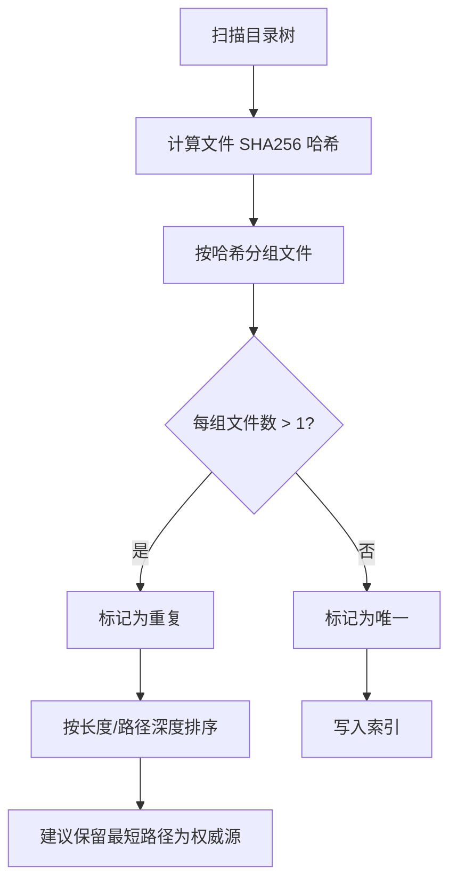
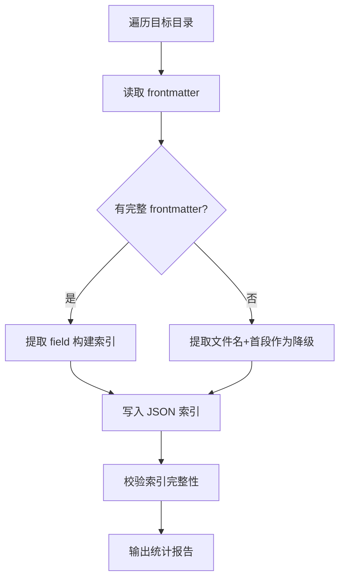

# YYC³ CLI — 自研完整版架构

> **深栈智启新纪元 · 统一入口 · 零外部依赖**
> **设计原则**：无外部 npm 运行时依赖、纯 Node.js 内置模块、单文件可部署

---

## 一、CLI 命名与定位

```
名称: yyci   (YYC³ Intelligence)
定位: YYC³ Skills 工作区统一管理 CLI
入口: 单文件 bin/yyci.js → 支持 npx yyci / npm exec yyci
技术栈: Node.js >=20 (仅使用内置模块 fs/path/child_process)
```

## 二、命令树

```
yyci
├── init             初始化工作区（创建标准目录结构 + 索引）
│   ├── --force      强制覆盖现有配置
│   └── --template   选择模板（minimal / full）
│
├── build            构建 / 重建全局索引
│   ├── agents       构建 Agent 索引（_agents_index.json）
│   ├── skills       构建 Skill 索引（_categories.json）
│   ├── mcps         构建 MCP 索引（_mcps_index.json）
│   ├── tools        构建 Tool 索引（_tools_index.json）
│   └── all          构建所有索引（默认）
│
├── validate         完整性验证 + 去重检测
│   ├── agents       检测 Agent 定义完整性
│   ├── skills       检测 Skill 重复 + 缺失 frontmatter
│   ├── links        检测交叉引用断裂
│   ├── duplicates   检测全量重复文件
│   └── all          全量验证（默认）
│       └── --fix    自动修复可修复项
│
├── doctor           诊断工作区健康状态
│   ├── --verbose    详细输出
│   └── --json       JSON 格式输出
│
├── registry         注册中心操作
│   ├── add <type> <path>   添加资产到注册中心
│   ├── remove <id>         从注册中心移除
│   ├── list [type]         列出资产
│   └── search <query>      搜索资产
│
├── i18n             国际化同步（关联 i18n 引擎）
│   ├── sync         同步所有语言翻译
│   ├── lint         检查翻译完整性
│   ├── export       导出翻译至 CSV
│   └── import       从 CSV 导入翻译
│
├── docs             文档操作
│   ├── generate     生成架构图 / 索引文档
│   └── check        检查文档断裂引用
│
├── version          显示版本信息
│   ├── --json       JSON 格式
│   └── --check      检查上游仓库版本
│
└── help [command]   显示帮助信息
```

## 三、技术架构

```
┌─────────────────────────────────────────────────────────────────────┐
│               yyci CLI 技术架构（零外部依赖）                        │
├─────────────────────────────────────────────────────────────────────┤
│                                                                     │
│  ┌─────────────────────────────────────────────────────────────┐   │
│  │  入口层: bin/yyci.js                                         │   │
│  │  #!/usr/bin/env node                                        │   │
│  │  解析 process.argv → 路由至对应命令                          │   │
│  └─────────────────────┬───────────────────────────────────────┘   │
│                        │                                             │
│  ┌─────────────────────▼───────────────────────────────────────┐   │
│  │  命令层: src/commands/                                       │   │
│  │  ├── init.js        │  ├── validate.js    │  ├── registry.js│   │
│  │  ├── build.js       │  ├── doctor.js      │  ├── i18n.js    │   │
│  │  └── help.js        │  └── version.js     │  └── docs.js    │   │
│  └─────────────────────┬───────────────────────────────────────┘   │
│                        │                                             │
│  ┌─────────────────────▼───────────────────────────────────────┐   │
│  │  引擎层: src/engine/                                         │   │
│  │  ├── indexer.js         索引构建引擎                          │   │
│  │  ├── validator.js       验证引擎                              │   │
│  │  ├── registry-center.js 注册中心                              │   │
│  │  ├── deduper.js         去重检测                              │   │
│  │  ├── i18n-engine.js     i18n 引擎                            │   │
│  │  └── doctor.js          诊断引擎                              │   │
│  └─────────────────────┬───────────────────────────────────────┘   │
│                        │                                             │
│  ┌─────────────────────▼───────────────────────────────────────┐   │
│  │  工具层: src/lib/                                            │   │
│  │  ├── fs-utils.js         文件操作（递归扫描/读写）           │   │
│  │  ├── path-resolver.js    路径解析（跨平台）                  │   │
│  │  ├── frontmatter.js      YAML frontmatter 解析              │   │
│  │  ├── hash.js             文件哈希（快速去重）                │   │
│  │  ├── logger.js           日志输出（彩色/JSON 模式）         │   │
│  │  └── config.js           配置加载                            │   │
│  └─────────────────────────────────────────────────────────────┘   │
│                                                                     │
└─────────────────────────────────────────────────────────────────────┘
```

## 四、核心算法

### 4.1 去重检测算法



### 4.2 索引构建算法



## 五、目录结构

```
packages/yyci/
├── bin/
│   └── yyci.js              # CLI 入口（#!/usr/bin/env node）
├── src/
│   ├── commands/            # 命令处理器
│   │   ├── init.js
│   │   ├── build.js
│   │   ├── validate.js
│   │   ├── doctor.js
│   │   ├── registry.js
│   │   ├── i18n.js
│   │   ├── docs.js
│   │   ├── version.js
│   │   └── help.js
│   ├── engine/              # 核心引擎
│   │   ├── indexer.js       # 索引构建
│   │   ├── validator.js     # 验证
│   │   ├── registry-center.js
│   │   ├── deduper.js       # 去重
│   │   ├── i18n-engine.js   # 国际化
│   │   └── doctor.js        # 诊断
│   └── lib/                 # 工具库
│       ├── fs-utils.js
│       ├── path-resolver.js
│       ├── frontmatter.js
│       ├── hash.js
│       ├── logger.js
│       └── config.js
├── test/
│   ├── unit/
│   │   ├── indexer.test.js
│   │   ├── validator.test.js
│   │   ├── deduper.test.js
│   │   └── frontmatter.test.js
│   └── fixtures/
│       ├── sample-skill/
│       └── duplicates/
├── package.json             # name: @yyc3/cli
└── README.md
```

## 六、零依赖策略

| 功能 | 实现方式 | 外部依赖 |
|------|----------|:--------:|
| CLI 入口 | `#!/usr/bin/env node` | ❌ 无 |
| 参数解析 | `process.argv` + 手动解析 | ❌ 无 |
| 文件扫描 | `fs.readdirSync` + 递归 | ❌ 无 |
| SHA256 哈希 | `crypto.createHash('sha256')` | ❌ 无 |
| YAML 解析 | 自制简易 frontmatter 解析器 | ❌ 无 |
| JSON 输出 | `JSON.stringify` + `console.log` | ❌ 无 |
| 彩色日志 | ANSI escape codes 硬编码 | ❌ 无 |
| 路径跨平台 | `path.posix` / `path.win32` | ❌ 无 |
| 测试 | Node.js 内置 `node:test` | ❌ 无 |
| CI | GitHub Actions (ubuntu-latest) | ❌ 无 |

## 七、使用示例

```bash
# 初始化工作区
npx yyci init

# 构建全部索引
npx yyci build all

# 验证完整性 + 查找重复
npx yyci validate duplicates --fix

# 诊断健康状态
npx yyci doctor --verbose

# 注册一个新 Skill
npx yyci registry add skill ./my-skill/SKILL.md

# 同步 i18n
npx yyci i18n sync

# 全文搜索
npx yyci registry search "rag-blueprint"
```

## 八、与现有工具的关系

```
现有工具              yyci 对标
─────────────────────────────────────
agent_indexer.py   →  yyci build agents
generate_categories.py → yyci build skills
dedup_check.sh     →  yyci validate duplicates
工具索引脚本        →  yyci build tools
手动注册            →  yyci registry add

发展策略：yyci 统一入口，保留现有脚本作为降级回退
```
