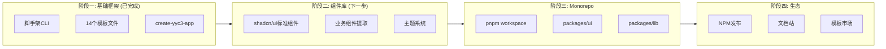

# YYC³ 复用框架体系规划

> 版本: v1.0.0
> 日期: 2026-04-26
> 技术栈: Next.js + React + shadcn/ui + Radix UI + pnpm
> 基于知识库 174,088 条代码资产分析

---

## 一、技术选型论证

### 1.1 技术栈矩阵

```
┌──────────────────────────────────────────────────────────┐
│                                                          │
│  YYC³ 复用框架技术栈                                      │
│                                                          │
│  ┌──────────────┐  ┌──────────────┐  ┌──────────────┐   │
│  │  框架层       │  │  UI层         │  │  工具链       │   │
│  │              │  │              │  │              │   │
│  │  Next.js 15  │  │  shadcn/ui   │  │  pnpm        │   │
│  │  App Router  │  │  Radix UI    │  │  TypeScript  │   │
│  │  React 19   │  │  Tailwind 4  │  │  ESLint 9    │   │
│  │  RSC        │  │  CSS变量      │  │  Vitest      │   │
│  └──────┬───────┘  └──────┬───────┘  └──────┬───────┘   │
│         │                 │                  │           │
│         └────────┬────────┘──────────────────┘           │
│                  │                                       │
│         ┌────────▼────────┐                              │
│         │  复用框架核心    │                              │
│         │  yyc3-template   │                              │
│         └─────────────────┘                              │
│                                                          │
└──────────────────────────────────────────────────────────┘
```

### 1.2 知识库资产验证

| 技术 | KB匹配条数 | 覆盖项目数 | 成熟度 |
|------|-----------|-----------|--------|
| Next.js | 6,725 | 46个分类 | ★★★★★ |
| React | 13,915 | 49个分类 | ★★★★★ |
| TypeScript | 40,819 | 51个分类 | ★★★★★ |
| shadcn/ui | 4,000+ | 15个分类 | ★★★★☆ |
| Tailwind | 3,000+ | 26个分类 | ★★★★★ |
| Radix UI | 融合在shadcn中 | 同上 | ★★★★☆ |
| pnpm | 已在用 | 全局 | ★★★★★ |

**结论：知识库中已有充足的相关代码资产，技术栈100%覆盖。**

### 1.3 选型优势

```
Next.js 15 App Router     → RSC + Streaming + Server Actions
React 19                  → use() + Actions + 优化并发
shadcn/ui                 → 可复制组件 + 无依赖锁定 + 完全可控
Radix UI                  → 无障碍优先 + Headless + 组合式API
Tailwind CSS 4            → 零运行时 + JIT + 设计系统令牌
pnpm                      → 硬链接节省磁盘 + monorepo原生支持 + 严格依赖
TypeScript 5.8            → 类型安全 + IDE全智能提示
```

---

## 二、复用框架架构设计

### 2.1 七层复用架构

```mermaid
graph TB
    subgraph L1["第1层: 项目脚手架"]
        S["create-yyc3-app<br/>一键生成项目"]
    end

    subgraph L2["第2层: 全局配置"]
        C1["next.config.ts"]
        C2["tailwind.config.ts"]
        C3["tsconfig.json"]
        C4[".env.example"]
        C5["pnpm-workspace.yaml"]
    end

    subgraph L3["第3层: 路由体系"]
        R1["app/layout.tsx<br/>全局布局"]
        R2["app/page.tsx<br/>页面模板"]
        R3["app/loading.tsx<br/>加载态"]
        R4["app/error.tsx<br/>错误边界"]
        R5["app/api/route.ts<br/>API路由"]
        R6["middleware.ts<br/>中间件"]
    end

    subgraph L4["第4层: UI组件库"]
        U1["components/ui/<br/>shadcn/ui标准组件"]
        U2["components/layout/<br/>布局组件"]
        U3["components/business/<br/>业务组件"]
    end

    subgraph L5["第5层: 基础服务"]
        S1["lib/api.ts<br/>请求封装"]
        S2["lib/auth.ts<br/>认证模块"]
        S3["lib/db.ts<br/>数据库连接"]
        S4["lib/utils.ts<br/>工具函数"]
        S5["lib/config.ts<br/>配置管理"]
    end

    subgraph L6["第6层: 错误处理"]
        E1["error-boundary<br/>错误边界"]
        E2["error-toast<br/>错误提示"]
        E3["error-log<br/>错误日志"]
        E4["error-fallback<br/>降级方案"]
    end

    subgraph L7["第7层: 部署运维"]
        D1["Dockerfile"]
        D2["docker-compose"]
        D3["CI/CD Pipeline"]
        D4["Nginx配置"]
    end

    L1 --> L2 --> L3 --> L4 --> L5 --> L6 --> L7
```



### 2.2 框架目录结构

```
yyc3-template/
├── app/
│   ├── layout.tsx                # 全局布局 (Header + Sidebar + Footer)
│   ├── page.tsx                  # 首页模板
│   ├── loading.tsx               # 全局加载态 (Skeleton)
│   ├── error.tsx                 # 全局错误页
│   ├── not-found.tsx             # 404页面
│   ├── globals.css               # Tailwind基础样式 + CSS变量
│   ├── (auth)/                   # 认证路由组
│   │   ├── login/page.tsx        # 登录页
│   │   └── register/page.tsx     # 注册页
│   ├── (dashboard)/              # 仪表盘路由组
│   │   ├── layout.tsx            # 仪表盘布局 (Sidebar + Content)
│   │   ├── page.tsx              # 仪表盘首页
│   │   └── [module]/             # 动态模块路由
│   │       ├── page.tsx          # 列表页
│   │       ├── [id]/page.tsx     # 详情页
│   │       └── loading.tsx       # 模块加载态
│   └── api/
│       ├── health/route.ts       # 健康检查
│       └── [...routes]/route.ts  # 统一API路由
│
├── components/
│   ├── ui/                       # shadcn/ui 标准组件
│   │   ├── button.tsx
│   │   ├── input.tsx
│   │   ├── dialog.tsx
│   │   ├── table.tsx
│   │   ├── form.tsx
│   │   ├── card.tsx
│   │   ├── badge.tsx
│   │   ├── toast.tsx
│   │   ├── dropdown-menu.tsx
│   │   ├── sheet.tsx
│   │   ├── skeleton.tsx
│   │   └── ... (按需添加)
│   ├── layout/
│   │   ├── header.tsx            # 顶部导航
│   │   ├── sidebar.tsx           # 侧边栏
│   │   ├── footer.tsx            # 页脚
│   │   ├── breadcrumb.tsx        # 面包屑
│   │   └── nav-user.tsx          # 用户导航
│   └── business/
│       ├── data-table.tsx        # 通用数据表格
│       ├── search-bar.tsx        # 搜索栏
│       ├── filter-panel.tsx      # 筛选面板
│       ├── stat-card.tsx         # 统计卡片
│       └── chart-wrapper.tsx     # 图表包装器
│
├── lib/
│   ├── api.ts                    # API请求封装 (fetch + error handling)
│   ├── auth.ts                   # 认证模块 (NextAuth / JWT)
│   ├── db.ts                     # 数据库连接 (Drizzle ORM)
│   ├── utils.ts                  # 工具函数 (cn / formatDate / ...)
│   ├── config.ts                 # 配置管理 (env验证)
│   ├── hooks/                    # 自定义Hooks
│   │   ├── use-debounce.ts
│   │   ├── use-pagination.ts
│   │   └── use-toast.ts
│   └── validators/               # Zod验证器
│       ├── user.ts
│       └── common.ts
│
├── styles/
│   └── theme.css                 # 主题变量 (亮色/暗色)
│
├── infra/
│   ├── Dockerfile                # 多阶段构建
│   ├── docker-compose.yml        # 开发环境编排
│   ├── nginx.conf                # 反向代理配置
│   └── .github/workflows/
│       └── ci.yml                # CI/CD流水线
│
├── package.json                  # 标准依赖清单
├── pnpm-workspace.yaml           # pnpm workspace配置
├── next.config.ts                # Next.js配置
├── tailwind.config.ts            # Tailwind + shadcn配置
├── tsconfig.json                 # TypeScript配置
├── postcss.config.mjs            # PostCSS配置
├── components.json               # shadcn/ui配置
├── .env.example                  # 环境变量模板
├── .eslintrc.json                # ESLint配置
├── .gitignore
└── README.md
```

---

## 三、shadcn/ui 组件复用策略

### 3.1 KB中shadcn/ui资产分布

| 项目分类 | shadcn组件数 | 代表性组件 |
|----------|-------------|-----------|
| mac-devops | 1,907 | Button/Table/Dialog/Form |
| yy-nexus | 1,434 | Card/Badge/Skeleton/Sidebar |
| dev-knowledge | 534 | Toast/Alert/Tooltip |
| app-yyc-m | 385 | DataTable/Filter/Chart |
| yyc3-table-converter | 254 | Table/Input/Select |
| yyc3-ai-medical | 107 | Card/Form/Dialog |
| app-dashboard | 62 | Chart/StatCard/Dashboard |
| 其他8个分类 | 300+ | 混合组件 |

### 3.2 标准组件清单 (从KB提取)

```
UI组件复用优先级:

P0 - 必须复用 (每个项目都用):
├── button.tsx          → 按钮 (变体: default/destructive/outline/ghost/link)
├── input.tsx           → 输入框
├── card.tsx            → 卡片容器
├── dialog.tsx          → 对话框 (Radix Dialog)
├── table.tsx           → 数据表格
├── form.tsx            → 表单 (react-hook-form + zod)
├── toast.tsx           → 提示 (Radix Toast)
├── dropdown-menu.tsx   → 下拉菜单 (Radix DropdownMenu)
└── skeleton.tsx        → 加载骨架

P1 - 高频复用 (80%项目用):
├── badge.tsx           → 标签
├── select.tsx          → 选择器 (Radix Select)
├── tabs.tsx            → 标签页 (Radix Tabs)
├── sheet.tsx           → 侧滑面板 (Radix Dialog)
├── avatar.tsx          → 头像 (Radix Avatar)
├── separator.tsx       → 分割线 (Radix Separator)
├── switch.tsx          → 开关 (Radix Switch)
├── textarea.tsx        → 文本域
└── tooltip.tsx         → 提示 (Radix Tooltip)

P2 - 按需复用 (特定场景):
├── calendar.tsx        → 日历
├── chart.tsx           → 图表 (Recharts包装)
├── command.tsx         → 命令面板 (cmdk)
├── popover.tsx         → 弹出框 (Radix Popover)
├── scroll-area.tsx     → 滚动区域 (Radix ScrollArea)
└── accordion.tsx       → 手风琴 (Radix Accordion)
```

---

## 四、Radix UI 底层能力映射

```
shadcn/ui → Radix UI 底层能力:

┌─────────────────────────────────────────────────────────┐
│                                                         │
│  Radix UI 提供的无障碍基础设施:                           │
│                                                         │
│  Dialog        → 模态/非模态 + 焦点锁定 + ESC关闭       │
│  DropdownMenu  → 键盘导航 + 点击外部关闭                 │
│  Select        → 搜索 + 虚拟滚动 + 多选                 │
│  Tabs          → 键盘箭头切换 + ARIA标签                 │
│  Toast         → 队列管理 + 自动关闭 + 暂停              │
│  Tooltip       → 延迟显示 + 焦点触发                     │
│  Popover       → 锚点定位 + 翻转 + 碰撞检测              │
│  Accordion     → 展开/折叠 + 键盘导航                    │
│  Avatar        → 加载态 + 回退显示                       │
│  ScrollArea    → 自定义滚动条 + 虚拟化                   │
│  Switch        → 开关 + ARIA角色                         │
│  Separator     → 分割线 + 语义化                         │
│                                                         │
│  shadcn/ui 封装:                                        │
│  ├── 统一className API (Tailwind)                       │
│  ├── 统一variant系统 (cva)                              │
│  ├── 统一主题变量 (CSS Variables)                        │
│  └── 零运行时依赖 (纯复制代码)                           │
│                                                         │
└─────────────────────────────────────────────────────────┘
```

---

## 五、pnpm Workspace Monorepo策略

### 5.1 推荐Monorepo结构

```
yyc3-workspace/
├── pnpm-workspace.yaml
│   packages:
│     - 'apps/*'
│     - 'packages/*'
│
├── apps/
│   ├── yyc3-dashboard/        # 仪表盘应用
│   ├── yyc3-ai-platform/      # AI平台
│   └── yyc3-api/              # API服务
│
├── packages/
│   ├── ui/                    # 共享UI组件库
│   │   ├── src/
│   │   │   ├── components/    # shadcn/ui组件
│   │   │   └── styles/        # 主题变量
│   │   └── package.json
│   │
│   ├── lib/                   # 共享工具库
│   │   ├── src/
│   │   │   ├── api.ts         # API封装
│   │   │   ├── auth.ts        # 认证
│   │   │   ├── utils.ts       # 工具函数
│   │   │   └── hooks/         # 共享Hooks
│   │   └── package.json
│   │
│   ├── config/                # 共享配置
│   │   ├── eslint/
│   │   ├── typescript/
│   │   └── tailwind/
│   │
│   └── validators/            # 共享验证器
│       └── zod-schemas/
│
├── templates/                 # 脚手架模板
│   └── create-yyc3-app
│
└── pnpm-workspace.yaml
```

### 5.2 pnpm 优势量化

| 指标 | npm/yarn | pnpm | 提升 |
|------|---------|------|------|
| 磁盘占用 | 10个项目 = 10×node_modules | 硬链接共享 | -60% |
| 安装速度 | 逐个安装 | 并行+内容寻址 | +2x |
| Monorepo | 需要Lerna/Nx | 原生workspace | 零配置 |
| 幽灵依赖 | 默认允许 | 严格隔离 | 零风险 |
| YYC³项目(30+) | ~15GB node_modules | ~6GB | 节省9GB |

---

## 六、复用率预期

### 6.1 新项目复用率预估

```
┌──────────────────────────────────────────────────────────┐
│                                                          │
│  新项目搭建复用率预估:                                    │
│                                                          │
│  传统方式 (从零开始):                                     │
│  ├── 配置文件编写          2-3小时                        │
│  ├── UI组件开发           3-5天                           │
│  ├── 路由/布局/错误处理    1天                             │
│  ├── API封装/认证          1-2天                           │
│  ├── Docker/CI/CD          0.5天                          │
│  └── 合计                  6-10天                         │
│                                                          │
│  YYC³ 复用框架:                                           │
│  ├── create-yyc3-app      1分钟                           │
│  ├── pnpm install         30秒                            │
│  ├── 配置.env             5分钟                           │
│  ├── 添加业务组件          按需                            │
│  └── 合计                  <1小时                         │
│                                                          │
│  复用率:                                                  │
│  ├── 配置层               100% (全部复用)                 │
│  ├── 路由体系             100% (全部复用)                  │
│  ├── UI组件               ~80% (标准组件复用)              │
│  ├── 基础服务             ~90% (API/Auth/DB复用)           │
│  ├── 错误处理             100% (全部复用)                  │
│  ├── 部署运维             100% (全部复用)                  │
│  └── 综合复用率           ~85%                             │
│                                                          │
│  效率提升: 6-10天 → <1小时 = 100倍                        │
│                                                          │
└──────────────────────────────────────────────────────────┘
```

---

## 七、实施路线图



| 阶段 | 内容 | 产出 |
|------|------|------|
| ✅ 阶段一 | 基础框架 | create-yyc3-app + 14模板 |
| 阶段二 | shadcn/ui组件库 | 20+标准组件 + 10+业务组件 |
| 阶段三 | pnpm Monorepo | packages/ui + packages/lib |
| 阶段四 | NPM生态 | @yyc3/ui + @yyc3/lib 发布 |

---

## 八、脚手架工具使用指南

### 8.1 创建新项目

```bash
# 从NAS模板目录执行
cd /Volume2/yyc3_sd/GLM-导师执导/templates
./create-yyc3-app yyc3-hailan -t dashboard -p 3201 -d "海蓝Pro管理平台"
./create-yyc3-app yyc3-ai-center -t ai-platform -p 3300 -d "AI智能中心"
./create-yyc3-app yyc3-api-gateway -t api -p 3400 -d "API网关"
```

### 8.2 添加shadcn/ui组件

```bash
cd yyc3-hailan
pnpm dlx shadcn@latest add button
pnpm dlx shadcn@latest add table dialog form
pnpm dlx shadcn@latest add card badge toast
```

### 8.3 运行开发服务器

```bash
pnpm install
cp .env.example .env.local
pnpm dev
# → http://localhost:3201
```

---

## 九、YYC³ 端口规范

| 端口范围 | 用途 | 示例 |
|----------|------|------|
| 3200 | 默认开发端口 | yyc3-template默认 |
| 3201-3299 | 业务项目 | yyc3-hailan:3201 |
| 3300-3399 | AI/智能服务 | yyc3-ai-center:3300 |
| 3400-3499 | API/后端 | yyc3-api:3400 |
| 3000-3199 | ❌ 限制使用 | 第三方默认端口冲突 |
| 3500+ | 工具/监控 | pgAdmin/Redis等 |

---

## 十、变更日志

### v1.0.0 (2026-04-26)
- 技术栈论证: Next.js + React + shadcn/ui + Radix UI + pnpm
- KB资产验证: shadcn/ui 4,000+条代码覆盖
- 七层复用架构设计
- 框架目录结构定义
- shadcn/ui组件复用策略 (P0/P1/P2三级)
- Radix UI底层能力映射
- pnpm Monorepo策略
- 复用率预估: ~85%
- 实施路线图: 四阶段
