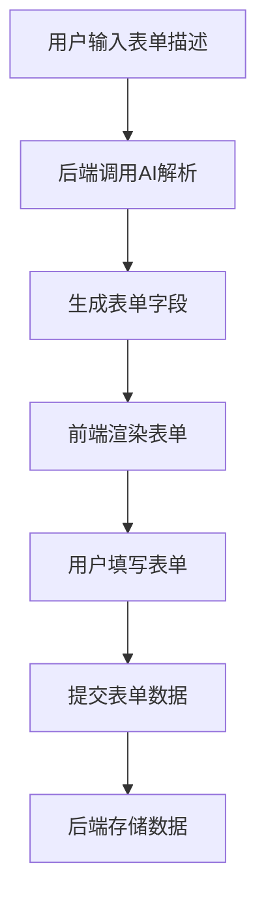

# 全栈智能应用可复用整合方案文件设计
本设计通过多个文件分别阐述方案各部分内容，涵盖代码实现与效果预览，便于直观理解与调整优化。
## 一、整体框架设计文件
```typescript
#!/bin/bash

# 创建主文件夹
mkdir full - stack - app - reusable - integration
cd full - stack - app - reusable - integration

# 创建整体框架设计文件夹及文件
mkdir 01 - overall - framework - design
cd 01 - overall - framework - design
touch tech -选型.md navigation - design.md
cd..

# 省略中间重复部分...

# 创建代码实现文件夹及子文件夹
mkdir src
cd src
mkdir frontend backend
cd frontend
mkdir pages components
cd..
cd backend
mkdir routes models
cd..

# 创建测试相关文件夹及文件
mkdir test
cd test
touch unit - tests.md functional - tests.md
mkdir performance - reports
cd..

# 创建配置文件文件夹及文件
mkdir config
cd config
touch database.config.js env.config.js
cd..

# 创建资源文件文件夹及子文件夹
mkdir assets
cd assets
mkdir images icons fonts
cd..

# 创建索引和汇总文件
touch README.md docs - summary.md

# 创建构建脚本文件
touch build - script.sh
chmod +x build - script.sh

echo "文件树架构已成功创建！"
```
在原build - script.sh脚本基础上，新增创建上述新增文件夹和文件的命令，例如：
```typescript
#!/bin/bash

# 创建主文件夹
mkdir full - stack - app - reusable - integration
cd full - stack - app - reusable - integration

# 创建整体框架设计文件夹及文件
mkdir 01 - overall - framework - design
cd 01 - overall - framework - design
touch tech -选型.md navigation - design.md
cd..

# 省略中间重复部分...

# 创建代码实现文件夹及子文件夹
mkdir src
cd src
mkdir frontend backend
cd frontend
mkdir pages components
cd..
cd backend
mkdir routes models
cd..

# 创建测试相关文件夹及文件
mkdir test
cd test
touch unit - tests.md functional - tests.md
mkdir performance - reports
cd..

# 创建配置文件文件夹及文件
mkdir config
cd config
touch database.config.js env.config.js
cd..

# 创建资源文件文件夹及子文件夹
mkdir assets
cd assets
mkdir images icons fonts
cd..

# 创建索引和汇总文件
touch README.md docs - summary.md

# 创建构建脚本文件
touch build - script.sh
chmod +x build - script.sh

echo "文件树架构已成功创建！"
```
### 1.1 技术选型说明（tech -选型.md）
详细阐述前端 Next.js、后端 Node.js + Express、数据库 MongoDB 及状态管理 Redux Toolkit 的选型依据与优势，补充示例代码说明集成方式。
```plaintext
# 技术选型
## 前端：Next.js
Next.js基于React，通过服务端渲染（SSR）提升页面加载速度，以下是一个简单的页面示例：
```jsx
import React from'react';

const HomePage = () => {
  return <div>欢迎来到全栈智能应用首页</div>;
};

export default HomePage;
```
其路由系统基于文件系统，在pages目录下创建文件即可生成对应路由。
## 后端：Node.js + Express
使用 Express 快速搭建 API 服务，示例代码创建一个获取用户列表的接口：
```plaintext
const express = require('express');
const app = express();
const User = require('./models/user');

app.get('/api/users', async (req, res) => {
  try {
    const users = await User.find();
    res.json(users);
  } catch (error) {
    res.status(500).json({ error: '获取用户列表失败' });
  }
});

module.exports = app;
```
## 数据库：MongoDB
通过 Mongoose 操作 MongoDB，定义用户模型示例：
```plaintext
const mongoose = require('mongoose');

const userSchema = new mongoose.Schema({
  name: String,
  email: String
});

module.exports = mongoose.model('User', userSchema);
```
## 状态管理：Redux Toolkit
使用 Redux Toolkit 管理全局状态，以计数器为例：
```plaintext
import { createSlice } from '@reduxjs/toolkit';

const counterSlice = createSlice({
  name: 'counter',
  initialState: { value: 0 },
  reducers: {
    increment: (state) => {
      state.value++;
    },
    decrement: (state) => {
      state.value--;
    }
  }
});

export const { increment, decrement } = counterSlice.actions;
export default counterSlice.reducer;
```
### 1.2 导航结构设计（navigation - design.md）
以图文结合形式展示一级、二级、三级导航的布局与交互效果，附上关键 CSS 与 JavaScript 代码。
```plaintext
# 导航结构设计
## 一级导航

固定于页面顶部，横向排列，核心代码如下：
```css
nav {
  position: fixed;
  top: 0;
  left: 0;
  width: 100%;
  background-color: #fff;
  display: flex;
  justify-content: space-around;
  padding: 10px 0;
  z - index: 100;
}
.nav - item {
  color: #4285F4;
  text - decoration: none;
  transition: color 0.3s, transform 0.3s;
}
.nav - item:hover {
  color: #FF5733;
  transform: scale(1.1);
}
```
## 二级导航
**

默认隐藏，点击一级导航项下滑展开，关键代码：
```plaintext
.sub - nav {
  max - height: 0;
  overflow: hidden;
  transition: max - height 0.3s ease;
  background - color: rgba(240, 240, 240, 0.8);
}
.sub - nav.active {
  max - height: 200px; /* 根据实际内容调整 */
}
```
通过 JavaScript 为一级导航项添加点击事件，控制二级导航的显示与隐藏：
```plaintext
const navItems = document.querySelectorAll('.nav - item');
const subNavs = document.querySelectorAll('.sub - nav');

navItems.forEach((item, index) => {
  item.addEventListener('click', () => {
    subNavs[index].classList.toggle('active');
  });
});
```
## 三级导航
在二级页面横向展示，选中项突出显示，效果与代码示例：
```plaintext
.third - nav {
  display: flex;
  justify-content: space - between;
  background - color: #F5F5F5;
  padding: 5px 10px;
}
.third - nav - item {
  color: #666666;
  text - decoration: none;
}
.third - nav - item.active {
  color: #4285F4;
  border - bottom: 2px solid #4285F4;
}
```
## 二、UI 设计规范文件
### 2.1 基础样式设计（base - style.md）
展示字体、字号、间距、背景色、文字色等基础样式的实际效果截图，提供完整 CSS 代码。
```plaintext
# 基础样式设计
## 字体效果
主字体思源黑体应用效果：

代码：
```css
body {
  font - family:'思源黑体', sans - serif;
  font - size: 16px;
  line - height: 1.6;
  color: #222222;
  background - color: #FFFFFF;
}
code,
pre {
  font - family: Consolas, monospace;
}
```
## 字号与间距
标题 H1（32px）与正文（16px）显示效果：

以 8px 为基准的间距布局示例：

### 2.2 组件库设计（component - library.md）
分别对基础组件和功能组件进行代码实现与效果展示，包含按钮、输入框、数据表格、日历等组件。
```plaintext
# 组件库设计
## 基础组件 - 按钮组件
### 主按钮

```css
.btn - primary {
  background - color: #4285F4;
  color: #FFFFFF;
  border: none;
  padding: 8px 16px;
  border - radius: 4px;
  cursor: pointer;
  transition: background - color 0.3s ease;
}
.btn - primary:hover {
  background - color: #357AE8;
}
```
在 React 中使用：
```plaintext
import React from'react';

const MyButton = () => {
  return <button className="btn - primary">点击我</button>;
};

export default MyButton;
```
### 输入框组件
效果图：

代码：
```plaintext
.input - field {
  border: 1px solid #E5E7EB;
  padding: 6px 12px;
  border - radius: 4px;
  outline: none;
  transition: border - color 0.3s ease;
}
.input - field:focus {
  border - color: var(--module - primary - color);
}
```
## 功能组件 - 数据表格组件
数据表格行背景交替与选中效果：

```plaintext
.table {
  width: 100%;
  border - collapse: collapse;
}
.table tr:nth - child(even) {
  background - color: #F9FAFB;
}
.table tr:hover {
  background - color: #E5F6FF;
}
.table tr.selected {
  background - color: #E5F6FF;
}
```
## 三、色彩体系文件（color - system.md）
用色卡展示主色调、辅助色调，结合实际页面截图说明色彩在各功能模块的应用。
```plaintext
# 色彩体系
## 主色调
品牌主色#4285F4色卡：

应用于核心按钮示例：


## 辅助色调
强调色#FF5733应用于警示信息：

中性色#F0F0F0作为背景效果：


## 色彩应用 - 数据中心
蓝色系（#4285F4及其渐变）在数据中心页面的应用：

用户管理模块绿色系应用：

营销模块橙色系应用：
 

## 四、交互设计文件（`interaction - design.md`）
通过GIF动态图展示点击、页面跳转、悬停等通用交互效果，以及智能表单、客户管理等功能模块的交互流程，并附上代码片段。
```markdown
# 交互设计
## 通用交互 - 点击操作
点击按钮的波纹扩散动画（GIF动态图）：

关键CSS代码：
```css
.btn {
  position: relative;
  overflow: hidden;
}
.btn::after {
  content: "";
  position: absolute;
  width: 100%;
  height: 100%;
  top: 0;
  left: 0;
  background - color: rgba(66, 133, 244, 0.3);
  transform: scale(0);
  border - radius: 50%;
  transition: transform 0.3s ease;
  z - index: -1;
}
.btn:active::after {
  transform: scale(2);
  opacity: 0;
}
```
## 页面跳转
从右向左滑动过渡动画（GIF 动态图）：

借助 Next.js 路由与 CSS 实现：
```plaintext
// Next.js路由配置相关代码...
```
```plaintext
.page - transition {
  overflow: hidden;
}
.page - transition > div {
  transform: translateX(100%);
  opacity: 0;
  transition: transform 0.5s ease, opacity 0.5s ease;
}
.page - transition.page - enter - active > div,
.page - transition.page - leave - active > div {
  transform: translateX(0);
  opacity: 1;
}
```
## 功能模块交互 - 智能表单
输入验证正确与错误反馈（GIF 动态图）：

```plaintext
// React表单验证相关代码...
```
```plaintext
.input - success {
  border - color: #36D399;
}
.input - error {
  border - color: #E53E3E;
}
```
## 五、动画设计文件（animation - design.md）
以视频或 GIF 形式呈现基础动画和功能动画效果，详细说明动画时长、缓动函数等参数设置及代码实现。
```plaintext
# 动画设计
## 基础动画规则 - 常规动画
按钮悬停缩放动画（GIF动态图）：

时长0.3秒，缓动函数ease - in - out，代码：
```css
.button {
  transition: transform 0.3s ease - in - out;
}
.button:hover {
  transform: scale(1.05);
}
```
## 强调动画
重要提示出现的弹性缓动动画（视频链接或 GIF）：

使用 GSAP 库实现：
```plaintext
import React, { useEffect } from'react';
import gsap from 'gsap';

const ImportantTip = () => {
  useEffect(() => {
    gsap.to('.tip', {
      opacity: 1,
      scale: 1,
      ease: 'elastic.out(1, 0.3)',
      duration: 0.5
    });
  }, []);

  return <div className="tip">重要提示内容</div>;
};

export default ImportantTip;
```
## 功能动画 - 导航动画
二级导航展开动画（GIF 动态图）：

```plaintext
.sub - nav {
  max - height: 0;
  overflow: hidden;
  transition: max - height 0.3s ease;
}
.sub - nav.active {
  max - height: 200px;
}
```
## 六、功能模块实现文件（function - module - implementation.md）
对智能数据管理、用户与客户管理等六大功能模块，分别用流程图展示业务流程，结合代码实现与效果预览进行详细说明。
```plaintext
# 功能模块实现
## 智能数据管理 - 智能表单系统
### 业务流程

### 代码实现与效果
前端表单生成效果：


关键代码：
```plaintext
import React, { useState, useEffect } from'react';
import axios from 'axios';

const AutoForm = () => {
  const [formFields, setFormFields] = useState([]);
  const [description, setDescription] = useState('');

  useEffect(() => {
    const fetchFormFields = async () => {
      try {
        const response = await axios.post('/api/generate - form', { description });
        setFormFields(response.data.fields);
      } catch (error) {
        console.error('Error generating form:', error);
      }
    };
    if (description) {
      fetchFormFields();
    }
  }, [description]);

  return (
    <div>
      <input
        type="text"
        placeholder="输入表单描述"
        value={description}
        onChange={(e) => setDescription(e.target.value)}
      />
      {formFields.map((field, index) => (
        <input
          key={index}
          type="text"
          placeholder={field.name}
          name={field.name}
        />
      ))}
    </div>
  );
};

export default AutoForm;
```
## 七、行业特性与人性化设计文件（industry - features - humanized - design.md）
结合服务管理行业特点，通过案例说明弹性功能配置、沟通优化、员工关怀深化等设计的实际应用场景与效果。
```plaintext
# 行业特性与人性化设计
## 弹性功能配置
小型服务企业初期仅启用核心功能界面示例：

随着企业发展，逐步启用高级分析功能后的界面：


## 沟通优化 - 员工沟通满意度调查
满意度调查页面示例：

自动生成的分析报告示例：


## 员工关怀深化 - 心理健康咨询服务
心理咨询服务入口与咨询界面示例：

 

以上多个文件从不同维度详细设计全栈智能应用可复用整合方案，涵盖代码、效果与说明。你可对任一文件内容提出修改意见，或补充新的需求，以便进一步优化。
```
[八、智能开发流程文件（intelligent - development - process.md）](https://docs.qq.com/aio/DWFdLUFZISGJUREpB?p=0lIxEII4bsBRNrj4CBTCrZ)
[十、特别指导提醒文件（special - guidance - reminder.md）（续）](https://docs.qq.com/aio/DWFdLUFZISGJUREpB?p=94oIF5KtBfTv7PNZyUSext)
[十、特别指导提醒文件（special - guidance - reminder.md）（续）](https://docs.qq.com/aio/DWFdLUFZISGJUREpB?p=tf9xROLA8vD7QMkz7nPyIh)
[全栈智能应用可复用整合方案文件树架构及构建脚本](https://docs.qq.com/aio/DWFdLUFZISGJUREpB?p=z2PZIfjGwuKnEON9y6zHo4)
[脚本](https://docs.qq.com/aio/DWFdLUFZISGJUREpB?p=AFLsaoKT7papdNBLQsYe84)